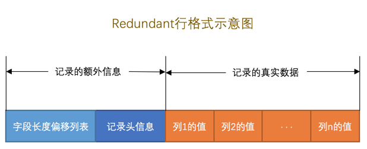

# InnoDB

## InnoDB读写数据的方式是什么？
InnoDB采取的方式是：将数据划分为若干个页，以页作为磁盘和内存之间交互的基本单位，InnoDB中页的大小一般为 16 KB。也就是在一般情况下，一次最少从磁盘中读取16KB的内容到内存中，一次最少把内存中的16KB内容刷新到磁盘中。
当记录中的数据太多，当前页放不下的时候，会把多余的数据存储到其他页中，这种现象称为行溢出。
## InnoDB的行格式有哪些？
- Compact
- Redundant
- Dynamic
- Compressed

## 如何指定行格式？
```
CREATE TABLE 表名 (列的信息) ROW_FORMAT=行格式名称
ALTER TABLE 表名 ROW_FORMAT=行格式名称
```
mysql5.6中默認的row_format是compact；

mysql5.7中默認的row_format通過變量設置

    mysql> show variables like '%row_format%';
    +---------------------------+---------+
    | Variable_name             | Value   |
    +---------------------------+---------+
    | innodb_default_row_format | dynamic |
    +---------------------------+---------+
    1 row in set (0.00 sec)
    mysql> SET GLOBAL innodb_default_row_format=DYNAMIC;

查看數據庫中表的行格式等信息

    mysql> show table status in xiaohaizi\G
    *************************** 1. row ***************************
                Name: record_format_demo
              Engine: InnoDB
             Version: 10
          Row_format: Compact
                Rows: 2
      Avg_row_length: 8192
         Data_length: 16384
     Max_data_length: 0
        Index_length: 0
           Data_free: 0
      Auto_increment: NULL
         Create_time: 2020-03-27 10:48:38
         Update_time: NULL
          Check_time: NULL
           Collation: ascii_general_ci
            Checksum: NULL
      Create_options: row_format=COMPACT
             Comment: 
    Max_index_length: 0
           Temporary: N
    1 row in set (0.01 sec)


## Compact行格式的结构


### 变长字段长度列表
变长字段长度列表，即Mysql支持的一些可变长的数据类型，包括如下
- varchar(m)
- varbinary(m)
- text
- blob

变长字段长度列表的这些长度值需要按照列的逆序存放

变长字段长度列表存储需要占用空间，记录的每一列使用1个字节还是2个字节存储依据以下规则：
我们首先声明一下W、M和L的意思：
- W, 某个字符集中表示一个字符最多需要使用的字节数, 比方说utf8字符集中的W就是3，gbk字符集中的W就是2，ascii字符集中的W就是1
- M, 对于变长类型VARCHAR(M)来说，这种类型表示能存储最多M个字符, 所以这个类型能表示的字符串最多占用的字节数就是M×W
- L, 它实际存储的字符串占用的字节数

- M*W <= 255  使用1个字节
- M*W > 255
    - L <= 127 使用1个字节
    - L > 127  使用2个字节

变长字段长度列表中只存储值为 非NULL 的列内容占用的长度，值为 NULL 的列的长度是不储存的 。

例子
```
Create Table: CREATE TABLE `record_format_demo` (
  `c1` varchar(10) DEFAULT NULL,    // 10*1 < 255   NULL
  `c2` varchar(10) NOT NULL,        // 10*1 < 255   NOT NULL
  `c3` char(10) DEFAULT NULL,       // 非可变长字段   NULL
  `c4` varchar(10) DEFAULT NULL     // 10*1 < 255   NULL
) ENGINE=InnoDB DEFAULT CHARSET=ascii ROW_FORMAT=COMPACT
1 row in set (0.00 sec)

mysql> select * from record_format_demo;
+------+-----+------+------+
| c1   | c2  | c3   | c4   |
+------+-----+------+------+
| aaaa | bbb | cc   | d    |
| eeee | fff | NULL | NULL |
+------+-----+------+------+
2 rows in set (0.01 sec)

```
示意图如下，第一条记录的变长列表占用3个字节：0x010x030x04表示c4c2c1列，第二条记录的可变长列表占用2个字节


### NULL值列表
存储规则
- 统计表中允许存储NULL的列有哪些。
- 如果表中没有允许存储 NULL 的列，则 NULL值列表 也不存在了
- 将每个允许存储NULL的列对应一个二进制位，二进制位按照列的顺序逆序排列，二进制位表示的意义如下：
    - 二进制位的值为1时，代表该列的值为NULL。
    - 二进制位的值为0时，代表该列的值不为NULL。
- MySQL规定NULL值列表必须用整数个字节的位表示，如果使用的二进制位个数不是整数个字节，则在字节的高位补0。如果一个表中有9个允许为NULL，那这个记录的NULL值列表部分就需要2个字节来表示了。

示意图如下，第二行 00000110 表示c4c3是NULLc1不是NULL，转化为十六进制为0x06


### 记录头信息
由固定的5个字节组成。5个字节也就是40个二进制位，不同的位代表不同的意思

|名称|	大小（单位：bit）|	描述|
| ---- | ---- | ---- |
|预留位1|	1|	没有使用|
预留位2	|1	|没有使用|
delete_mask|	1|	标记该记录是否被删除
min_rec_mask	|1|	B+树的每层非叶子节点中的最小记录都会添加该标记
n_owned	|4|	表示当前记录拥有的记录数
heap_no	|13|	表示当前记录在记录堆的位置信息
record_type	|3|	表示当前记录的类型，0表示普通记录，1表示B+树非叶子节点记录，2表示最小记录，3表示最大记录
next_record	|16|	表示下一条记录的相对位置

### 紀錄的真實數據
除了我们自己定义的列的数据以外，MySQL会为每个记录默认的添加一些列（也称为隐藏列）

列名	|是否必须|	占用空间|	描述
----|----|----|----
DB_ROW_ID	|否|	6字节|	行ID，唯一标识一条记录
DB_TRX_ID|	是|	6字节|	事务ID
DB_ROLL_PTR|   是|	7字节|	回滚指针


表裡面內容參考ascii碼 ```$man ascii```

### char(m)類型的存儲格式
如果採用的字符集是定長字符集，那麼不需要紀錄到前面變長字段長度列表中。例如ascii表示一個字符使用一個字節。
如果採用的字符集是變長字符集，那麼也需要給char(m)類型的字段長度紀錄到前面變長字段長度列表中。例如gbk一個字符（1～2字節），utf8一個字符（1～3字節）

## Redundant行格式



第一行：
    
    第一列(`row_id`)的长度就是 0x06个字节，也就是6个字节。
    
    第二列(`transaction_id`)的长度就是 (0x0C - 0x06)个字节，也就是6个字节。
    
    第三列(`roll_pointer`)的长度就是 (0x13 - 0x0C)个字节，也就是7个字节。
    
    第四列(`c1`)的长度就是 (0x17 - 0x13)个字节，也就是4个字节。
    
    第五列(`c2`)的长度就是 (0x1A - 0x17)个字节，也就是3个字节。
    
    第六列(`c3`)的长度就是 (0x24 - 0x1A)个字节，也就是10个字节。
    
    第七列(`c4`)的长度就是 (0x25 - 0x24)个字节，也就是1个字节。
    
 ## 行溢出数据
 ### VARCHAR(M)最多能存储的数据
 
     mysql>  CREATE TABLE varchar_size_demo(c VARCHAR(65535)) CHARSET=ascii ROW_FORMAT=Compact;
     ERROR 1074 (42000): Column length too big for column 'c' (max = 65532); use BLOB or TEXT instead
     mysql>  
     mysql>  CREATE TABLE varchar_size_demo(c VARCHAR(65532)) CHARSET=ascii ROW_FORMAT=Compact;
     Query OK, 0 rows affected (0.10 sec)
     
     mysql> CREATE TABLE varchar_size_demo3(c VARCHAR(65533) NOT NULL) CHARSET=gbk ROW_FORMAT=Compact;
     ERROR 1074 (42000): Column length too big for column 'c' (max = 32766); use BLOB or TEXT instead
     mysql> 
     mysql> CREATE TABLE varchar_size_demo3(c VARCHAR(65533)) CHARSET=gbk ROW_FORMAT=Compact;
     ERROR 1074 (42000): Column length too big for column 'c' (max = 32766); use BLOB or TEXT instead
     mysql> 
     mysql> CREATE TABLE varchar_size_demo3(c VARCHAR(65533)) CHARSET=utf8 ROW_FORMAT=Compact;
     ERROR 1074 (42000): Column length too big for column 'c' (max = 21844); use BLOB or TEXT instead
     mysql> 
     mysql> CREATE TABLE varchar_size_demo3(c VARCHAR(65533) NOT NULL) CHARSET=utf8 ROW_FORMAT=Compact;
     ERROR 1074 (42000): Column length too big for column 'c' (max = 21844); use BLOB or TEXT instead
     mysql> 

     
 對於ascii字符集，如果该VARCHAR类型的列没有NOT NULL属性，那最多只能存储65532个字节的数据，
 因为真实数据的长度可能占用2个字节，NULL值标识需要占用1个字节。 （這兒存疑，NOT NULL時候也是只能65532個字節）

### 行溢出

    mysql> CREATE TABLE varchar_size_demo(
        ->       c VARCHAR(65532)
        -> ) CHARSET=ascii ROW_FORMAT=Compact;
    Query OK, 0 rows affected (0.01 sec)
    
    mysql> INSERT INTO varchar_size_demo(c) VALUES(REPEAT('a', 65532));
    Query OK, 1 row affected (0.00 sec)

MySQL中磁盘和内存交互的基本单位是页，也就是说MySQL是以页为基本单位来管理存储空间的，我们的记录都会被分配到某个页中存储。
而一个页的大小一般是16KB，也就是16384字节，而一个VARCHAR(M)类型的列就最多可以存储65532个字节，
这样就可能造成一个页存放不了一条记录的情况。

在Compact和Redundant行格式中，对于占用存储空间非常大的列，在记录的真实数据处只会存储该列的一部分数据，
把剩余的数据分散存储在几个其他的页中，然后记录的真实数据处用20个字节存储指向这些页的地址
（当然这20个字节中还包括这些分散在其他页面中的数据的占用的字节数），从而可以找到剩余数据所在的页，如图所示：


不只是 VARCHAR(M) 类型的列，其他的 TEXT、BLOB 类型的列在存储数据非常多的时候也会发生行溢出。

## Dynamic和Compressed行格式
 Dynamic和Compressed行格式，这俩行格式和Compact行格式挺像，只不过在处理行溢出数据时有点儿分歧，它们不会在记录的真实数据处存储字段真实数据的前768个字节，而是把所有的字节都存储到其他页面中，只在记录的真实数据处存储其他页面的地址
 
 Compressed行格式和Dynamic不同的一点是，Compressed行格式会采用压缩算法对页面进行压缩，以节省空间。
 
 
 
 