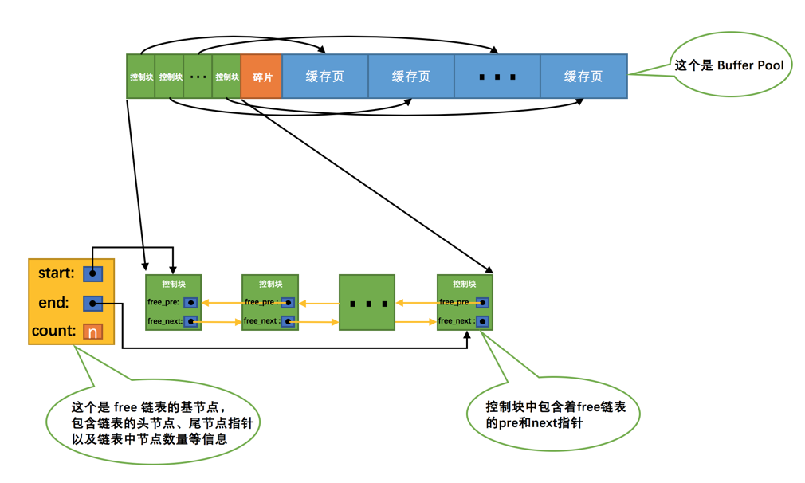
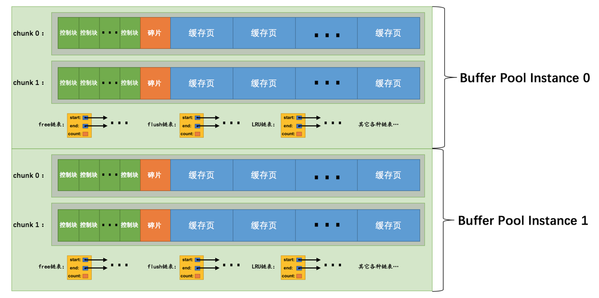

# buffer pool

## 缓存的重要性
通过前边的唠叨我们知道，对于使用InnoDB作为存储引擎的表来说，不管是用于存储用户数据的索引（包括聚簇索引和二级索引），还是各种系统数据，都是以页的形式存放在表空间中的，而所谓的表空间只不过是InnoDB对文件系统上一个或几个实际文件的抽象，也就是说我们的数据说到底还是存储在磁盘上的。但是各位也都知道，磁盘的速度慢的跟乌龟一样，怎么能配得上“快如风，疾如电”的CPU呢？所以InnoDB存储引擎在处理客户端的请求时，当需要访问某个页的数据时，就会把完整的页的数据全部加载到内存中，也就是说即使我们只需要访问一个页的一条记录，那也需要先把整个页的数据加载到内存中。将整个页加载到内存中后就可以进行读写访问了，在进行完读写访问之后并不着急把该页对应的内存空间释放掉，而是将其缓存起来，这样将来有请求再次访问该页面时，就可以省去磁盘IO的开销了。

## InnoDB的Buffer Pool
### 啥是个Buffer Pool
设计InnoDB的大叔为了缓存磁盘中的页，在MySQL服务器启动的时候就向操作系统申请了一片连续的内存，他们给这片内存起了个名，叫做Buffer Pool（中文名是缓冲池）。那它有多大呢？这个其实看我们机器的配置，如果你是土豪，你有512G内存，你分配个几百G作为Buffer Pool也可以啊，当然你要是没那么有钱，设置小点也行呀～ 默认情况下Buffer Pool只有128M大小。当然如果你嫌弃这个128M太大或者太小，可以在启动服务器的时候配置innodb_buffer_pool_size参数的值，它表示Buffer Pool的大小，就像这样：
    
    [server]
    innodb_buffer_pool_size = 268435456
其中，268435456的单位是字节，也就是我指定Buffer Pool的大小为256M。需要注意的是，Buffer Pool也不能太小，最小值为5M(当小于该值时会自动设置成5M)。

### Buffer Pool内部组成
Buffer Pool中默认的缓存页大小和在磁盘上默认的页大小是一样的，都是16KB。为了更好的管理这些在Buffer Pool中的缓存页，设计InnoDB的大叔为每一个缓存页都创建了一些所谓的控制信息，这些控制信息包括该页所属的表空间编号、页号、缓存页在Buffer Pool中的地址、链表节点信息、一些锁信息以及LSN信息（锁和LSN我们之后会具体唠叨，现在可以先忽略），当然还有一些别的控制信息，我们这就不全唠叨一遍了，挑重要的说嘛～

每个缓存页对应的控制信息占用的内存大小是相同的，我们就把每个页对应的控制信息占用的一块内存称为一个控制块吧，控制块和缓存页是一一对应的，它们都被存放到 Buffer Pool 中，其中控制块被存放到 Buffer Pool 的前边，缓存页被存放到 Buffer Pool 后边，所以整个Buffer Pool对应的内存空间看起来就是这样的：

咦？控制块和缓存页之间的那个碎片是个什么玩意儿？你想想啊，每一个控制块都对应一个缓存页，那在分配足够多的控制块和缓存页后，可能剩余的那点儿空间不够一对控制块和缓存页的大小，自然就用不到喽，这个用不到的那点儿内存空间就被称为碎片了。当然，如果你把Buffer Pool的大小设置的刚刚好的话，也可能不会产生碎片～

小贴士： 每个控制块大约占用缓存页大小的5%，在MySQL5.7.21这个版本中，每个控制块占用的大小是808字节。而我们设置的innodb_buffer_pool_size并不包含这部分控制块占用的内存空间大小，也就是说InnoDB在为Buffer Pool向操作系统申请连续的内存空间时，这片连续的内存空间一般会比innodb_buffer_pool_size的值大5%左右。

### free链表的管理
当我们最初启动MySQL服务器的时候，需要完成对Buffer Pool的初始化过程，就是先向操作系统申请Buffer Pool的内存空间，然后把它划分成若干对控制块和缓存页。但是此时并没有真实的磁盘页被缓存到Buffer Pool中（因为还没有用到），之后随着程序的运行，会不断的有磁盘上的页被缓存到Buffer Pool中。那么问题来了，从磁盘上读取一个页到Buffer Pool中的时候该放到哪个缓存页的位置呢？或者说怎么区分Buffer Pool中哪些缓存页是空闲的，哪些已经被使用了呢？我们最好在某个地方记录一下Buffer Pool中哪些缓存页是可用的，这个时候缓存页对应的控制块就派上大用场了，我们可以把所有空闲的缓存页对应的控制块作为一个节点放到一个链表中，这个链表也可以被称作free链表（或者说空闲链表）。刚刚完成初始化的Buffer Pool中所有的缓存页都是空闲的，所以每一个缓存页对应的控制块都会被加入到free链表中，假设该Buffer Pool中可容纳的缓存页数量为n，那增加了free链表的效果图就是这样的：

从图中可以看出，我们为了管理好这个free链表，特意为这个链表定义了一个基节点，里边儿包含着链表的头节点地址，尾节点地址，以及当前链表中节点的数量等信息。这里需要注意的是，链表的基节点占用的内存空间并不包含在为Buffer Pool申请的一大片连续内存空间之内，而是单独申请的一块内存空间。

小贴士： 链表基节点占用的内存空间并不大，在MySQL5.7.21这个版本里，每个基节点只占用40字节大小。后边我们即将介绍许多不同的链表，它们的基节点和free链表的基节点的内存分配方式是一样一样的，都是单独申请的一块40字节大小的内存空间，并不包含在为Buffer Pool申请的一大片连续内存空间之内。

有了这个free链表之后事儿就好办了，每当需要从磁盘中加载一个页到Buffer Pool中时，就从free链表中取一个空闲的缓存页，并且把该缓存页对应的控制块的信息填上（就是该页所在的表空间、页号之类的信息），然后把该缓存页对应的free链表节点从链表中移除，表示该缓存页已经被使用了～

### 缓存页的哈希处理
我们前边说过，当我们需要访问某个页中的数据时，就会把该页从磁盘加载到Buffer Pool中，如果该页已经在Buffer Pool中的话直接使用就可以了。那么问题也就来了，我们怎么知道该页在不在Buffer Pool中呢？难不成需要依次遍历Buffer Pool中各个缓存页么？一个Buffer Pool中的缓存页这么多都遍历完岂不是要累死？

再回头想想，我们其实是根据表空间号 + 页号来定位一个页的，也就相当于表空间号 + 页号是一个key，缓存页就是对应的value，怎么通过一个key来快速找着一个value呢？哈哈，那肯定是哈希表喽～

所以我们可以用表空间号 + 页号作为key，缓存页作为value创建一个哈希表，在需要访问某个页的数据时，先从哈希表中根据表空间号 + 页号看看有没有对应的缓存页，如果有，直接使用该缓存页就好，如果没有，那就从free链表中选一个空闲的缓存页，然后把磁盘中对应的页加载到该缓存页的位置。

### flush链表的管理
如果我们修改了Buffer Pool中某个缓存页的数据，那它就和磁盘上的页不一致了，这样的缓存页也被称为脏页（英文名：dirty page）。当然，最简单的做法就是每发生一次修改就立即同步到磁盘上对应的页上，但是频繁的往磁盘中写数据会严重的影响程序的性能（毕竟磁盘慢的像乌龟一样）。所以每次修改缓存页后，我们并不着急立即把修改同步到磁盘上，而是在未来的某个时间点进行同步，至于这个同步的时间点我们后边会作说明说明的，现在先不用管哈～

但是如果不立即同步到磁盘的话，那之后再同步的时候我们怎么知道Buffer Pool中哪些页是脏页，哪些页从来没被修改过呢？总不能把所有的缓存页都同步到磁盘上吧，假如Buffer Pool被设置的很大，比方说300G，那一次性同步这么多数据岂不是要慢死！所以，我们不得不再创建一个存储脏页的链表，凡是修改过的缓存页对应的控制块都会作为一个节点加入到一个链表中，因为这个链表节点对应的缓存页都是需要被刷新到磁盘上的，所以也叫flush链表。链表的构造和free链表差不多，假设某个时间点Buffer Pool中的脏页数量为n，那么对应的flush链表就长这样：

### LRU链表的管理
#### 缓存不够的窘境
Buffer Pool对应的内存大小毕竟是有限的，如果需要缓存的页占用的内存大小超过了Buffer Pool大小，也就是free链表中已经没有多余的空闲缓存页的时候岂不是很尴尬，发生了这样的事儿该咋办？当然是把某些旧的缓存页从Buffer Pool中移除，然后再把新的页放进来喽～ 那么问题来了，移除哪些缓存页呢？

为了回答这个问题，我们还需要回到我们设立Buffer Pool的初衷，我们就是想减少和磁盘的IO交互，最好每次在访问某个页的时候它都已经被缓存到Buffer Pool中了。假设我们一共访问了n次页，那么被访问的页已经在缓存中的次数除以n就是所谓的缓存命中率，我们的期望就是让缓存命中率越高越好～ 从这个角度出发，回想一下我们的微信聊天列表，排在前边的都是最近很频繁使用的，排在后边的自然就是最近很少使用的，假如列表能容纳下的联系人有限，你是会把最近很频繁使用的留下还是最近很少使用的留下呢？废话，当然是留下最近很频繁使用的了～

#### 简单的LRU链表
管理Buffer Pool的缓存页其实也是这个道理，当Buffer Pool中不再有空闲的缓存页时，就需要淘汰掉部分最近很少使用的缓存页。不过，我们怎么知道哪些缓存页最近频繁使用，哪些最近很少使用呢？呵呵，神奇的链表再一次派上了用场，我们可以再创建一个链表，由于这个链表是为了按照最近最少使用的原则去淘汰缓存页的，所以这个链表可以被称为LRU链表（LRU的英文全称：Least Recently Used）。当我们需要访问某个页时，可以这样处理LRU链表：

如果该页不在Buffer Pool中，在把该页从磁盘加载到Buffer Pool中的缓存页时，就把该缓存页对应的控制块作为节点塞到链表的头部。

如果该页已经缓存在Buffer Pool中，则直接把该页对应的控制块移动到LRU链表的头部。

也就是说：只要我们使用到某个缓存页，就把该缓存页调整到LRU链表的头部，这样LRU链表尾部就是最近最少使用的缓存页喽～ 所以当Buffer Pool中的空闲缓存页使用完时，到LRU链表的尾部找些缓存页淘汰就OK啦，真简单，啧啧...

#### 划分区域的LRU链表
高兴的太早了，上边的这个简单的LRU链表用了没多长时间就发现问题了，因为存在这两种比较尴尬的情况：

- 情况一：InnoDB提供了一个看起来比较贴心的服务——预读（英文名：read ahead）。所谓预读，就是InnoDB认为执行当前的请求可能之后会读取某些页面，就预先把它们加载到Buffer Pool中。根据触发方式的不同，预读又可以细分为下边两种：

    - 线性预读
    
    设计InnoDB的大叔提供了一个系统变量innodb_read_ahead_threshold，如果顺序访问了某个区（extent）的页面超过这个系统变量的值，就会触发一次异步读取下一个区中全部的页面到Buffer Pool的请求，注意异步读取意味着从磁盘中加载这些被预读的页面并不会影响到当前工作线程的正常执行。这个innodb_read_ahead_threshold系统变量的值默认是56，我们可以在服务器启动时通过启动参数或者服务器运行过程中直接调整该系统变量的值，不过它是一个全局变量，注意使用SET GLOBAL命令来修改哦。
    
    小贴士： InnoDB是怎么实现异步读取的呢？在Windows或者Linux平台上，可能是直接调用操作系统内核提供的AIO接口，在其它类Unix操作系统中，使用了一种模拟AIO接口的方式来实现异步读取，其实就是让别的线程去读取需要预读的页面。如果你读不懂上边这段话，那也就没必要懂了，和我们主题其实没太多关系，你只需要知道异步读取并不会影响到当前工作线程的正常执行就好了。其实这个过程涉及到操作系统如何处理IO以及多线程的问题，找本操作系统的书看看吧，什么？操作系统的书写的都很难懂？没关系，等我～
    
    - 随机预读
    
    如果Buffer Pool中已经缓存了某个区的13个连续的页面，不论这些页面是不是顺序读取的，都会触发一次异步读取本区中所有其的页面到Buffer Pool的请求。设计InnoDB的大叔同时提供了innodb_random_read_ahead系统变量，它的默认值为OFF，也就意味着InnoDB并不会默认开启随机预读的功能，如果我们想开启该功能，可以通过修改启动参数或者直接使用SET GLOBAL命令把该变量的值设置为ON。
    
    预读本来是个好事儿，如果预读到Buffer Pool中的页成功的被使用到，那就可以极大的提高语句执行的效率。可是如果用不到呢？这些预读的页都会放到LRU链表的头部，但是如果此时Buffer Pool的容量不太大而且很多预读的页面都没有用到的话，这就会导致处在LRU链表尾部的一些缓存页会很快的被淘汰掉，也就是所谓的劣币驱逐良币，会大大降低缓存命中率。

- 情况二：有的小伙伴可能会写一些需要扫描全表的查询语句（比如没有建立合适的索引或者压根儿没有WHERE子句的查询）。

扫描全表意味着什么？意味着将访问到该表所在的所有页！假设这个表中记录非常多的话，那该表会占用特别多的页，当需要访问这些页时，会把它们统统都加载到Buffer Pool中，这也就意味着吧唧一下，Buffer Pool中的所有页都被换了一次血，其他查询语句在执行时又得执行一次从磁盘加载到Buffer Pool的操作。而这种全表扫描的语句执行的频率也不高，每次执行都要把Buffer Pool中的缓存页换一次血，这严重的影响到其他查询对 Buffer Pool的使用，从而大大降低了缓存命中率。

总结一下上边说的可能降低Buffer Pool的两种情况：

加载到Buffer Pool中的页不一定被用到。

如果非常多的使用频率偏低的页被同时加载到Buffer Pool时，可能会把那些使用频率非常高的页从Buffer Pool中淘汰掉。

因为有这两种情况的存在，所以设计InnoDB的大叔把这个LRU链表按照一定比例分成两截，分别是：

一部分存储使用频率非常高的缓存页，所以这一部分链表也叫做热数据，或者称young区域。

另一部分存储使用频率不是很高的缓存页，所以这一部分链表也叫做冷数据，或者称old区域。

为了方便大家理解，我们把示意图做了简化，各位领会精神就好：

大家要特别注意一个事儿：我们是按照某个比例将LRU链表分成两半的，不是某些节点固定是young区域的，某些节点固定是old区域的，随着程序的运行，某个节点所属的区域也可能发生变化。那这个划分成两截的比例怎么确定呢？对于InnoDB存储引擎来说，我们可以通过查看系统变量innodb_old_blocks_pct的值来确定old区域在LRU链表中所占的比例，比方说这样：
    
    mysql> SHOW VARIABLES LIKE 'innodb_old_blocks_pct';
    +-----------------------+-------+
    | Variable_name         | Value |
    +-----------------------+-------+
    | innodb_old_blocks_pct | 37    |
    +-----------------------+-------+
    1 row in set (0.01 sec)
从结果可以看出来，默认情况下，old区域在LRU链表中所占的比例是37%，也就是说old区域大约占LRU链表的3/8。这个比例我们是可以设置的，我们可以在启动时修改innodb_old_blocks_pct参数来控制old区域在LRU链表中所占的比例，比方说这样修改配置文件：
    
    [server]
    innodb_old_blocks_pct = 40
这样我们在启动服务器后，old区域占LRU链表的比例就是40%。当然，如果在服务器运行期间，我们也可以修改这个系统变量的值，不过需要注意的是，这个系统变量属于全局变量，一经修改，会对所有客户端生效，所以我们只能这样修改：
    
    SET GLOBAL innodb_old_blocks_pct = 40;
有了这个被划分成young和old区域的LRU链表之后，设计InnoDB的大叔就可以针对我们上边提到的两种可能降低缓存命中率的情况进行优化了：

- 针对预读的页面可能不进行后续访问情况的优化

设计InnoDB的大叔规定，当磁盘上的某个页面在初次加载到Buffer Pool中的某个缓存页时，该缓存页对应的控制块会被放到old区域的头部。这样针对预读到Buffer Pool却不进行后续访问的页面就会被逐渐从old区域逐出，而不会影响young区域中被使用比较频繁的缓存页。

- 针对全表扫描时，短时间内访问大量使用频率非常低的页面情况的优化

在进行全表扫描时，虽然首次被加载到Buffer Pool的页被放到了old区域的头部，但是后续会被马上访问到，每次进行访问的时候又会把该页放到young区域的头部，这样仍然会把那些使用频率比较高的页面给顶下去。有同学会想：可不可以在第一次访问该页面时不将其从old区域移动到young区域的头部，后续访问时再将其移动到young区域的头部。回答是：行不通！因为设计InnoDB的大叔规定每次去页面中读取一条记录时，都算是访问一次页面，而一个页面中可能会包含很多条记录，也就是说读取完某个页面的记录就相当于访问了这个页面好多次。

咋办？全表扫描有一个特点，那就是它的执行频率非常低，谁也不会没事儿老在那写全表扫描的语句玩，而且在执行全表扫描的过程中，即使某个页面中有很多条记录，也就是去多次访问这个页面所花费的时间也是非常少的。所以我们只需要规定，在对某个处在old区域的缓存页进行第一次访问时就在它对应的控制块中记录下来这个访问时间，如果后续的访问时间与第一次访问的时间在某个时间间隔内，那么该页面就不会被从old区域移动到young区域的头部，否则将它移动到young区域的头部。上述的这个间隔时间是由系统变量innodb_old_blocks_time控制的，你看：
    
    mysql> SHOW VARIABLES LIKE 'innodb_old_blocks_time';
    +------------------------+-------+
    | Variable_name          | Value |
    +------------------------+-------+
    | innodb_old_blocks_time | 1000  |
    +------------------------+-------+
    1 row in set (0.01 sec)
这个innodb_old_blocks_time的默认值是1000，它的单位是毫秒，也就意味着对于从磁盘上被加载到LRU链表的old区域的某个页来说，如果第一次和最后一次访问该页面的时间间隔小于1s（很明显在一次全表扫描的过程中，多次访问一个页面中的时间不会超过1s），那么该页是不会被加入到young区域的～ 当然，像innodb_old_blocks_pct一样，我们也可以在服务器启动或运行时设置innodb_old_blocks_time的值，这里就不赘述了，你自己试试吧～ 这里需要注意的是，如果我们把innodb_old_blocks_time的值设置为0，那么每次我们访问一个页面时就会把该页面放到young区域的头部。

综上所述，正是因为将LRU链表划分为young和old区域这两个部分，又添加了innodb_old_blocks_time这个系统变量，才使得预读机制和全表扫描造成的缓存命中率降低的问题得到了遏制，因为用不到的预读页面以及全表扫描的页面都只会被放到old区域，而不影响young区域中的缓存页。

#### 更进一步优化LRU链表
LRU链表这就说完了么？没有，早着呢～ 对于young区域的缓存页来说，我们每次访问一个缓存页就要把它移动到LRU链表的头部，这样开销是不是太大啦，毕竟在young区域的缓存页都是热点数据，也就是可能被经常访问的，这样频繁的对LRU链表进行节点移动操作是不是不太好啊？是的，为了解决这个问题其实我们还可以提出一些优化策略，比如只有被访问的缓存页位于young区域的1/4的后边，才会被移动到LRU链表头部，这样就可以降低调整LRU链表的频率，从而提升性能（也就是说如果某个缓存页对应的节点在young区域的1/4中，再次访问该缓存页时也不会将其移动到LRU链表头部）。

小贴士： 我们之前介绍随机预读的时候曾说，如果Buffer Pool中有某个区的13个连续页面就会触发随机预读，这其实是不严谨的（不幸的是MySQL文档就是这么说的[摊手]），其实还要求这13个页面是非常热的页面，所谓的非常热，指的是这些页面在整个young区域的头1/4处。

还有没有什么别的针对LRU链表的优化措施呢？当然有啊，你要是好好学，写篇论文，写本书都不是问题，可是这毕竟是一个介绍MySQL基础知识的文章，再说多了篇幅就受不了了，也影响大家的阅读体验，所以适可而止，想了解更多的优化知识，自己去看源码或者更多关于LRU链表的知识喽～ 但是不论怎么优化，千万别忘了我们的初心：尽量高效的提高 Buffer Pool 的缓存命中率。

### 其他的一些链表
为了更好的管理Buffer Pool中的缓存页，除了我们上边提到的一些措施，设计InnoDB的大叔们还引进了其他的一些链表，比如unzip LRU链表用于管理解压页，zip clean链表用于管理没有被解压的压缩页，zip free数组中每一个元素都代表一个链表，它们组成所谓的伙伴系统来为压缩页提供内存空间等等，反正是为了更好的管理这个Buffer Pool引入了各种链表或其他数据结构，具体的使用方式就不啰嗦了，大家有兴趣深究的再去找些更深的书或者直接看源代码吧，也可以直接来找我哈～

小贴士： 我们压根儿没有深入唠叨过InnoDB中的压缩页，对上边的这些链表也只是为了完整性顺便提一下，如果你看不懂千万不要抑郁，因为我压根儿就没打算向大家介绍它们。

### 刷新脏页到磁盘
后台有专门的线程每隔一段时间负责把脏页刷新到磁盘，这样可以不影响用户线程处理正常的请求。主要有两种刷新路径：

- 从LRU链表的冷数据中刷新一部分页面到磁盘。

后台线程会定时从LRU链表尾部开始扫描一些页面，扫描的页面数量可以通过系统变量innodb_lru_scan_depth来指定，如果从里边儿发现脏页，会把它们刷新到磁盘。这种刷新页面的方式被称之为BUF_FLUSH_LRU。

- 从flush链表中刷新一部分页面到磁盘。

后台线程也会定时从flush链表中刷新一部分页面到磁盘，刷新的速率取决于当时系统是不是很繁忙。这种刷新页面的方式被称之为BUF_FLUSH_LIST。

有时候后台线程刷新脏页的进度比较慢，导致用户线程在准备加载一个磁盘页到Buffer Pool时没有可用的缓存页，这时就会尝试看看LRU链表尾部有没有可以直接释放掉的未修改页面，如果没有的话会不得不将LRU链表尾部的一个脏页同步刷新到磁盘（和磁盘交互是很慢的，这会降低处理用户请求的速度）。这种刷新单个页面到磁盘中的刷新方式被称之为BUF_FLUSH_SINGLE_PAGE。

当然，有时候系统特别繁忙时，也可能出现用户线程批量的从flush链表中刷新脏页的情况，很显然在处理用户请求过程中去刷新脏页是一种严重降低处理速度的行为（毕竟磁盘的速度慢的要死），这属于一种迫不得已的情况，不过这得放在后边唠叨redo日志的checkpoint时说了。

## 多个Buffer Pool实例
我们上边说过，Buffer Pool本质是InnoDB向操作系统申请的一块连续的内存空间，在多线程环境下，访问Buffer Pool中的各种链表都需要加锁处理啥的，在Buffer Pool特别大而且多线程并发访问特别高的情况下，单一的Buffer Pool可能会影响请求的处理速度。所以在Buffer Pool特别大的时候，我们可以把它们拆分成若干个小的Buffer Pool，每个Buffer Pool都称为一个实例，它们都是独立的，独立的去申请内存空间，独立的管理各种链表，独立的吧啦吧啦，所以在多线程并发访问时并不会相互影响，从而提高并发处理能力。我们可以在服务器启动的时候通过设置innodb_buffer_pool_instances的值来修改Buffer Pool实例的个数，比方说这样：
    
    [server]
    innodb_buffer_pool_instances = 2
这样就表明我们要创建2个Buffer Pool实例，示意图就是这样：

小贴士： 为了简便，我只把各个链表的基节点画出来了，大家应该心里清楚这些链表的节点其实就是每个缓存页对应的控制块！

那每个Buffer Pool实例实际占多少内存空间呢？其实使用这个公式算出来的：
    
    innodb_buffer_pool_size/innodb_buffer_pool_instances
也就是总共的大小除以实例的个数，结果就是每个Buffer Pool实例占用的大小。

不过也不是说Buffer Pool实例创建的越多越好，分别管理各个Buffer Pool也是需要性能开销的，设计InnoDB的大叔们规定：当innodb_buffer_pool_size的值小于1G的时候设置多个实例是无效的，InnoDB会默认把innodb_buffer_pool_instances 的值修改为1。而我们鼓励在Buffer Pool大于或等于1G的时候设置多个Buffer Pool实例。

### innodb_buffer_pool_chunk_size
在MySQL 5.7.5之前，Buffer Pool的大小只能在服务器启动时通过配置innodb_buffer_pool_size启动参数来调整大小，在服务器运行过程中是不允许调整该值的。不过设计MySQL的大叔在5.7.5以及之后的版本中支持了在服务器运行过程中调整Buffer Pool大小的功能，但是有一个问题，就是每次当我们要重新调整Buffer Pool大小时，都需要重新向操作系统申请一块连续的内存空间，然后将旧的Buffer Pool中的内容复制到这一块新空间，这是极其耗时的。所以设计MySQL的大叔们决定不再一次性为某个Buffer Pool实例向操作系统申请一大片连续的内存空间，而是以一个所谓的chunk为单位向操作系统申请空间。也就是说一个Buffer Pool实例其实是由若干个chunk组成的，一个chunk就代表一片连续的内存空间，里边儿包含了若干缓存页与其对应的控制块，画个图表示就是这样：

上图代表的Buffer Pool就是由2个实例组成的，每个实例中又包含2个chunk。

正是因为发明了这个chunk的概念，我们在服务器运行期间调整Buffer Pool的大小时就是以chunk为单位增加或者删除内存空间，而不需要重新向操作系统申请一片大的内存，然后进行缓存页的复制。这个所谓的chunk的大小是我们在启动操作MySQL服务器时通过innodb_buffer_pool_chunk_size启动参数指定的，它的默认值是134217728，也就是128M。不过需要注意的是，innodb_buffer_pool_chunk_size的值只能在服务器启动时指定，在服务器运行过程中是不可以修改的。

## 配置Buffer Pool时的注意事项
innodb_buffer_pool_size必须是innodb_buffer_pool_chunk_size × innodb_buffer_pool_instances的倍数（这主要是想保证每一个Buffer Pool实例中包含的chunk数量相同）。

假设我们指定的innodb_buffer_pool_chunk_size的值是128M，innodb_buffer_pool_instances的值是16，那么这两个值的乘积就是2G，也就是说innodb_buffer_pool_size的值必须是2G或者2G的整数倍。比方说我们在启动MySQL服务器是这样指定启动参数的：

mysqld --innodb-buffer-pool-size=8G --innodb-buffer-pool-instances=16
默认的innodb_buffer_pool_chunk_size值是128M，指定的innodb_buffer_pool_instances的值是16，所以innodb_buffer_pool_size的值必须是2G或者2G的整数倍，上边例子中指定的innodb_buffer_pool_size的值是8G，符合规定，所以在服务器启动完成之后我们查看一下该变量的值就是我们指定的8G（8589934592字节）：
    
    mysql> show variables like 'innodb_buffer_pool_size';
    +-------------------------+------------+
    | Variable_name           | Value      |
    +-------------------------+------------+
    | innodb_buffer_pool_size | 8589934592 |
    +-------------------------+------------+
    1 row in set (0.00 sec)
如果我们指定的innodb_buffer_pool_size大于2G并且不是2G的整数倍，那么服务器会自动的把innodb_buffer_pool_size的值调整为2G的整数倍，比方说我们在启动服务器时指定的innodb_buffer_pool_size的值是9G：

mysqld --innodb-buffer-pool-size=9G --innodb-buffer-pool-instances=16
那么服务器会自动把innodb_buffer_pool_size的值调整为10G（10737418240字节），不信你看：
    
    mysql> show variables like 'innodb_buffer_pool_size';
    +-------------------------+-------------+
    | Variable_name           | Value       |
    +-------------------------+-------------+
    | innodb_buffer_pool_size | 10737418240 |
    +-------------------------+-------------+
    1 row in set (0.01 sec)
如果在服务器启动时，innodb_buffer_pool_chunk_size × innodb_buffer_pool_instances的值已经大于innodb_buffer_pool_size的值，那么innodb_buffer_pool_chunk_size的值会被服务器自动设置为innodb_buffer_pool_size/innodb_buffer_pool_instances的值。

比方说我们在启动服务器时指定的innodb_buffer_pool_size的值为2G，innodb_buffer_pool_instances的值为16，innodb_buffer_pool_chunk_size的值为256M：

mysqld --innodb-buffer-pool-size=2G --innodb-buffer-pool-instances=16 --innodb-buffer-pool-chunk-size=256M
由于256M × 16 = 4G，而4G > 2G，所以innodb_buffer_pool_chunk_size值会被服务器改写为innodb_buffer_pool_size/innodb_buffer_pool_instances的值，也就是：2G/16 = 128M（134217728字节），不信你看：
    
    mysql> show variables like 'innodb_buffer_pool_size';
    +-------------------------+------------+
    | Variable_name           | Value      |
    +-------------------------+------------+
    | innodb_buffer_pool_size | 2147483648 |
    +-------------------------+------------+
    1 row in set (0.01 sec)
    
    mysql> show variables like 'innodb_buffer_pool_chunk_size';
    +-------------------------------+-----------+
    | Variable_name                 | Value     |
    +-------------------------------+-----------+
    | innodb_buffer_pool_chunk_size | 134217728 |
    +-------------------------------+-----------+
    1 row in set (0.00 sec)
## Buffer Pool中存储的其它信息
Buffer Pool的缓存页除了用来缓存磁盘上的页面以外，还可以存储锁信息、自适应哈希索引等信息

## 查看Buffer Pool的状态信息
设计MySQL的大叔贴心的给我们提供了SHOW ENGINE INNODB STATUS语句来查看关于InnoDB存储引擎运行过程中的一些状态信息，其中就包括Buffer Pool的一些信息，我们看一下（为了突出重点，我们只把输出中关于Buffer Pool的部分提取了出来）：
    
    mysql> SHOW ENGINE INNODB STATUS\G
    
    (...省略前边的许多状态)
    ----------------------
    BUFFER POOL AND MEMORY
    ----------------------
    Total memory allocated 13218349056;
    Dictionary memory allocated 4014231
    Buffer pool size   786432
    Free buffers       8174
    Database pages     710576
    Old database pages 262143
    Modified db pages  124941
    Pending reads 0
    Pending writes: LRU 0, flush list 0, single page 0
    Pages made young 6195930012, not young 78247510485
    108.18 youngs/s, 226.15 non-youngs/s
    Pages read 2748866728, created 29217873, written 4845680877
    160.77 reads/s, 3.80 creates/s, 190.16 writes/s
    Buffer pool hit rate 956 / 1000, young-making rate 30 / 1000 not 605 / 1000
    Pages read ahead 0.00/s, evicted without access 0.00/s, Random read ahead 0.00/s
    LRU len: 710576, unzip_LRU len: 118
    I/O sum[134264]:cur[144], unzip sum[16]:cur[0]
    --------------
    (...省略后边的许多状态)

我们来详细看一下这里边的每个值都代表什么意思：

Total memory allocated：代表Buffer Pool向操作系统申请的连续内存空间大小，包括全部控制块、缓存页、以及碎片的大小。

Dictionary memory allocated：为数据字典信息分配的内存空间大小，注意这个内存空间和Buffer Pool没啥关系，不包括在Total memory allocated中。

Buffer pool size：代表该Buffer Pool可以容纳多少缓存页，注意，单位是页！

Free buffers：代表当前Buffer Pool还有多少空闲缓存页，也就是free链表中还有多少个节点。

Database pages：代表LRU链表中的页的数量，包含young和old两个区域的节点数量。

Old database pages：代表LRU链表old区域的节点数量。

Modified db pages：代表脏页数量，也就是flush链表中节点的数量。

Pending reads：正在等待从磁盘上加载到Buffer Pool中的页面数量。

当准备从磁盘中加载某个页面时，会先为这个页面在Buffer Pool中分配一个缓存页以及它对应的控制块，然后把这个控制块添加到LRU的old区域的头部，但是这个时候真正的磁盘页并没有被加载进来，Pending reads的值会跟着加1。

Pending writes LRU：即将从LRU链表中刷新到磁盘中的页面数量。

Pending writes flush list：即将从flush链表中刷新到磁盘中的页面数量。

Pending writes single page：即将以单个页面的形式刷新到磁盘中的页面数量。

Pages made young：代表LRU链表中曾经从old区域移动到young区域头部的节点数量。

这里需要注意，一个节点每次只有从old区域移动到young区域头部时才会将Pages made young的值加1，也就是说如果该节点本来就在young区域，由于它符合在young区域1/4后边的要求，下一次访问这个页面时也会将它移动到young区域头部，但这个过程并不会导致Pages made young的值加1。

Page made not young：在将innodb_old_blocks_time设置的值大于0时，首次访问或者后续访问某个处在old区域的节点时由于不符合时间间隔的限制而不能将其移动到young区域头部时，Page made not young的值会加1。

这里需要注意，对于处在young区域的节点，如果由于它在young区域的1/4处而导致它没有被移动到young区域头部，这样的访问并不会将Page made not young的值加1。

youngs/s：代表每秒从old区域被移动到young区域头部的节点数量。

non-youngs/s：代表每秒由于不满足时间限制而不能从old区域移动到young区域头部的节点数量。

Pages read、created、written：代表读取，创建，写入了多少页。后边跟着读取、创建、写入的速率。

Buffer pool hit rate：表示在过去某段时间，平均访问1000次页面，有多少次该页面已经被缓存到Buffer Pool了。

young-making rate：表示在过去某段时间，平均访问1000次页面，有多少次访问使页面移动到young区域的头部了。

需要大家注意的一点是，这里统计的将页面移动到young区域的头部次数不仅仅包含从old区域移动到young区域头部的次数，还包括从young区域移动到young区域头部的次数（访问某个young区域的节点，只要该节点在young区域的1/4处往后，就会把它移动到young区域的头部）。

not (young-making rate)：表示在过去某段时间，平均访问1000次页面，有多少次访问没有使页面移动到young区域的头部。

需要大家注意的一点是，这里统计的没有将页面移动到young区域的头部次数不仅仅包含因为设置了innodb_old_blocks_time系统变量而导致访问了old区域中的节点但没把它们移动到young区域的次数，还包含因为该节点在young区域的前1/4处而没有被移动到young区域头部的次数。

LRU len：代表LRU链表中节点的数量。

unzip_LRU：代表unzip_LRU链表中节点的数量（由于我们没有具体唠叨过这个链表，现在可以忽略它的值）。

I/O sum：最近50s读取磁盘页的总数。

I/O cur：现在正在读取的磁盘页数量。

I/O unzip sum：最近50s解压的页面数量。

I/O unzip cur：正在解压的页面数量。

## 总结
磁盘太慢，用内存作为缓存很有必要。

Buffer Pool本质上是InnoDB向操作系统申请的一段连续的内存空间，可以通过innodb_buffer_pool_size来调整它的大小。

Buffer Pool向操作系统申请的连续内存由控制块和缓存页组成，每个控制块和缓存页都是一一对应的，在填充足够多的控制块和缓存页的组合后，Buffer Pool剩余的空间可能产生不够填充一组控制块和缓存页，这部分空间不能被使用，也被称为碎片。

InnoDB使用了许多链表来管理Buffer Pool。

free链表中每一个节点都代表一个空闲的缓存页，在将磁盘中的页加载到Buffer Pool时，会从free链表中寻找空闲的缓存页。

为了快速定位某个页是否被加载到Buffer Pool，使用表空间号 + 页号作为key，缓存页作为value，建立哈希表。

在Buffer Pool中被修改的页称为脏页，脏页并不是立即刷新，而是被加入到flush链表中，待之后的某个时刻同步到磁盘上。

LRU链表分为young和old两个区域，可以通过innodb_old_blocks_pct来调节old区域所占的比例。首次从磁盘上加载到Buffer Pool的页会被放到old区域的头部，在innodb_old_blocks_time间隔时间内访问该页不会把它移动到young区域头部。在Buffer Pool没有可用的空闲缓存页时，会首先淘汰掉old区域的一些页。

我们可以通过指定innodb_buffer_pool_instances来控制Buffer Pool实例的个数，每个Buffer Pool实例中都有各自独立的链表，互不干扰。

自MySQL 5.7.5版本之后，可以在服务器运行过程中调整Buffer Pool大小。每个Buffer Pool实例由若干个chunk组成，每个chunk的大小可以在服务器启动时通过启动参数调整。

可以用下边的命令查看Buffer Pool的状态信息：

    SHOW ENGINE INNODB STATUS\G
