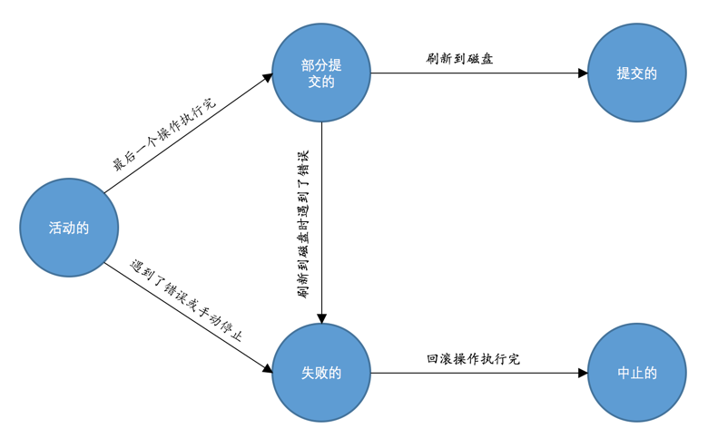

# transaction

## 原子性（Atomicity）
现实世界中转账操作是一个不可分割的操作，也就是说要么压根儿就没转，要么转账成功，不能存在中间的状态，也就是转了一半的这种情况。
设计数据库的大叔们把这种要么全做，要么全不做的规则称之为原子性

## 隔离性（Isolation）
所以对于现实世界中状态转换对应的某些数据库操作来说，不仅要保证这些操作以原子性的方式执行完成，
而且要保证其它的状态转换不会影响到本次状态转换，这个规则被称之为隔离性

## 一致性（Consistency）
如果数据库中的数据全部符合现实世界中的约束（all defined rules），我们说这些数据就是一致的，或者说符合一致性的。

我们前边唠叨的原子性和隔离性都会对一致性产生影响。
数据库某些操作的原子性和隔离性都是保证一致性的一种手段，在操作执行完成后保证符合所有既定的约束则是一种结果。

## 持久性（Durability）
当现实世界的一个状态转换完成后，这个转换的结果将永久的保留，这个规则被设计数据库的大叔们称为持久性

当把现实世界的状态转换映射到数据库世界时，持久性意味着该转换对应的数据库操作所修改的数据都应该在磁盘上保留下来，
不论之后发生了什么事故，本次转换造成的影响都不应该被丢失掉

## 事务transaction的概念
把需要保证原子性、隔离性、一致性和持久性的一个或多个数据库操作称之为一个事务（英文名是：transaction）。

ACID = Atomicity，Consistency，Isolation，Durability

### 事務的狀態
- 活动的（active）

事务对应的数据库操作正在执行过程中时，我们就说该事务处在活动的状态。

- 部分提交的（partially committed）

当事务中的最后一个操作执行完成，但由于操作都在内存中执行，所造成的影响并没有刷新到磁盘时，我们就说该事务处在部分提交的状态。

- 失败的（failed）

当事务处在活动的或者部分提交的状态时，可能遇到了某些错误（数据库自身的错误、操作系统错误或者直接断电等）而无法继续执行，
或者人为的停止当前事务的执行，我们就说该事务处在失败的状态。

- 中止的（aborted）

如果事务执行了半截而变为失败的状态，比如我们前边唠叨的狗哥向猫爷转账的事务，当狗哥账户的钱被扣除，但是猫爷账户的钱没有增加时遇到了错误，
从而当前事务处在了失败的状态，那么就需要把已经修改的狗哥账户余额调整为未转账之前的金额，
换句话说，就是要撤销失败事务对当前数据库造成的影响。
书面一点的话，我们把这个撤销的过程称之为回滚。当回滚操作执行完毕时，也就是数据库恢复到了执行事务之前的状态，我们就说该事务处在了中止的状态。

- 提交的（committed）

当一个处在部分提交的状态的事务将修改过的数据都同步到磁盘上之后，我们就可以说该事务处在了提交的状态。

狀態轉變圖

只有当事务处于提交的或者中止的状态时，一个事务的生命周期才算是结束了

### transaction 語法

```shell script
mysql> BEGIN;       # 開啟事務
Query OK, 0 rows affected (0.00 sec)

mysql> 加入事务的语句...

mysql> COMMIT [WORK] # 提交事務
```

```shell script
mysql> START TRANSACTION READ ONLY, WITH CONSISTENT SNAPSHOT;  # START TRANSACTION可以接修飾符
Query OK, 0 rows affected (0.00 sec)

mysql> 加入事务的语句...

mysql> ROLLBACK;  #回滾事務 

mysql> START TRANSACTION READ WRITE, WITH CONSISTENT SNAPSHOT;
Query OK, 0 rows affected (0.00 sec)

mysql> 加入事务的语句...
```

- READ ONLY：标识当前事务是一个只读事务，也就是属于该事务的数据库操作只能读取数据，而不能修改数据。
- READ WRITE：标识当前事务是一个读写事务，也就是属于该事务的数据库操作既可以读取数据，也可以修改数据。
- WITH CONSISTENT SNAPSHOT：启动一致性读。


ROLLBACK语句是我们程序员手动的去回滚事务时才去使用的，
如果事务在执行过程中遇到了某些错误而无法继续执行的话，事务自身会自动的回滚。

### 支持事務的存儲引擎
MySQL中并不是所有存储引擎都支持事务的功能，目前只有InnoDB和NDB存储引擎支持，
如果某个事务中包含了修改使用不支持事务的存储引擎的表，那么对该使用不支持事务的存储引擎的表所做的修改将无法进行回滚

### 自動提交
```shell script
mysql> SHOW VARIABLES LIKE 'autocommit';
+---------------+-------+
| Variable_name | Value |
+---------------+-------+
| autocommit    | ON    |
+---------------+-------+
1 row in set (0.01 sec)
```
可以看到它的默认值为ON，也就是说默认情况下，如果我们不显式的使用START TRANSACTION或者BEGIN语句开启一个事务，
那么每一条语句都算是一个独立的事务，这种特性称之为事务的自动提交。

### 隱式提交
- 定义或修改数据库对象的数据定义语言（Data definition language，缩写为：DDL）。

所谓的数据库对象，指的就是数据库、表、视图、存储过程等等这些东西。当我们使用CREATE、ALTER、DROP等语句去修改这些所谓的数据库对象时，
就会隐式的提交前边语句所属于的事务

- 隐式使用或修改mysql数据库中的表
当我们使用ALTER USER、CREATE USER、DROP USER、GRANT、RENAME USER、REVOKE、SET PASSWORD等语句时也会隐式的提交前边语句所属于的事务。

- 事务控制或关于锁定的语句
当我们在一个事务还没提交或者回滚时就又使用START TRANSACTION或者BEGIN语句开启了另一个事务时，会隐式的提交上一个事务.

或者当前的autocommit系统变量的值为OFF，我们手动把它调为ON时，也会隐式的提交前边语句所属的事务。

或者使用LOCK TABLES、UNLOCK TABLES等关于锁定的语句也会隐式的提交前边语句所属的事务。

- 加载数据的语句`LOAD DATA`

- 关于MySQL复制的一些语句
  
  使用START SLAVE、STOP SLAVE、RESET SLAVE、CHANGE MASTER TO等语句时也会隐式的提交前边语句所属的事务。
  
- 其它的一些语句
  
  使用ANALYZE TABLE、CACHE INDEX、CHECK TABLE、FLUSH、 LOAD INDEX INTO CACHE、OPTIMIZE TABLE、REPAIR TABLE、RESET等语句也会隐式的提交前边语句所属的事务
  
### 保存點
设计数据库的大叔们提出了一个保存点（英文：savepoint）的概念，就是在事务对应的数据库语句中打几个点，
我们在调用ROLLBACK语句时可以指定会滚到哪个点，而不是回到最初的原点。定义保存点的语法如下：

    SAVEPOINT 保存点名称;
    ROLLBACK [WORK] TO [SAVEPOINT] 保存点名称;

如果我们想删除某个保存点，可以使用这个语句：

    RELEASE SAVEPOINT 保存点名称;