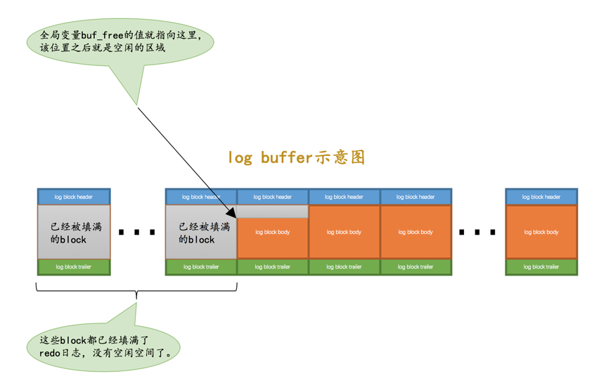
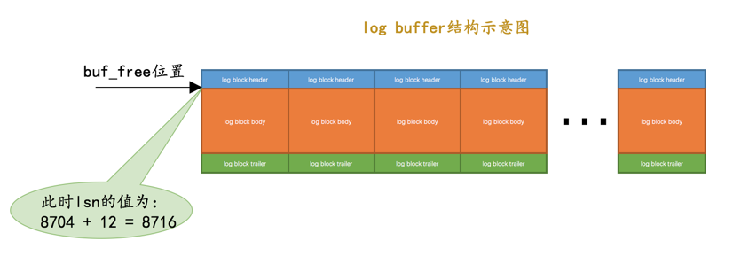
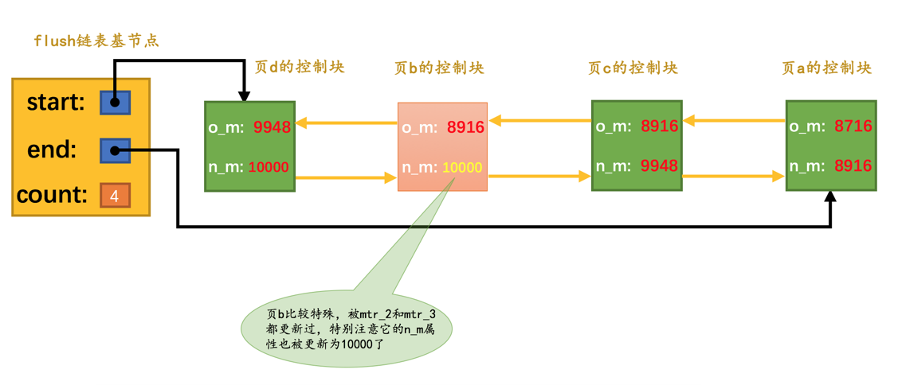

# redo日誌

## 定義
所以我们其实没有必要在每次事务提交时就把该事务在内存中修改过的全部页面刷新到磁盘，只需要把修改了哪些东西记录一下就好
这样我们在事务提交时，把日誌内容刷新到磁盘中，即使之后系统崩溃了，重启之后只要按照日誌内容所记录的步骤重新更新一下数据页，
那么该事务对数据库中所做的修改又可以被恢复出来，也就意味着满足持久性的要求。

因为在系统崩溃重启时需要按照上述内容所记录的步骤重新更新数据页，所以上述内容也被称之为重做日志，英文名为redo log

## 特點
- redo日志占用的空间非常小；

存储表空间ID、页号、偏移量以及需要更新的值所需的存储空间是很小的
- redo日志是顺序写入磁盘的；

在执行事务的过程中，每执行一条语句，就可能产生若干条redo日志，这些日志是按照产生的顺序写入磁盘的，顺序IO比随机IO要快

## redo日誌格式


- type：该条redo日志的类型。

在MySQL 5.7.21这个版本中，设计InnoDB的大叔一共为redo日志设计了53种不同的类型，稍后会详细介绍不同类型的redo日志。

- space ID：表空间ID。
- page number：页号。
- data：该条redo日志的具体内容。

## 紧凑行格式的记录时的redo日志类型


## Min-Transaction
### 以組的形式寫入redo日誌

设计InnoDB的大叔们认为向某个索引对应的B+树中插入一条记录的这个过程必须是原子的，
不能说插了一半之后就停止了。比方说在悲观插入过程中，新的页面已经分配好了，数据也复制过去了，新的记录也插入到页面中了，
可是没有向内节点中插入一条目录项记录，这个插入过程就是不完整的，这样会形成一棵不正确的B+树。
我们知道redo日志是为了在系统崩溃重启时恢复崩溃前的状态，如果在悲观插入的过程中只记录了一部分redo日志，
那么在系统崩溃重启时会将索引对应的B+树恢复成一种不正确的状态，这是设计InnoDB的大叔们所不能忍受的。
所以他们规定在执行这些需要保证原子性的操作时必须以组的形式来记录的redo日志，在进行系统崩溃重启恢复时，
针对某个组中的redo日志，要么把全部的日志都恢复掉，要么一条也不恢复。怎么做到的呢？

- 有的需要保证原子性的操作会生成多条redo日志，比如向某个索引对应的B+树中进行一次悲观插入就需要生成许多条redo日志。
在该组中的最后一条redo日志后边加上一条特殊类型的redo日志，该类型名称为MLOG_MULTI_REC_END，type字段对应的十进制数字为31，
该类型的redo日志结构很简单，只有一个type字段


- 有的需要保证原子性的操作只生成一条redo日志，比如更新Max Row ID属性的操作就只会生成一条redo日志。
type字段其实是占用1个字节的，也就是说我们可以省出来一个比特位用来表示该需要保证原子性的操作只产生单一的一条redo日志  
如果type字段的第一个比特位为1，代表该需要保证原子性的操作只产生了单一的一条redo日志，否则表示该需要保证原子性的操作产生了一系列的redo日志。


### Mini-Transaction的概念
设计MySQL的大叔把对底层页面中的一次原子访问的过程称之为一个Mini-Transaction，简称mtr

一个事务可以包含若干条语句，每一条语句其实是由若干个mtr组成，每一个mtr又可以包含若干条redo日志，画个图表示它们的关系就是这样：


## redo日志的写入过程
### redo log block

真正的redo日志都是存储到占用496字节大小的log block body中，
图中的log block header和log block trailer存储的是一些管理信息。我们来看看这些所谓的管理信息都是啥：


- LOG_BLOCK_HDR_NO：每一个block都有一个大于0的唯一标号，本属性就表示该标号值。

- LOG_BLOCK_HDR_DATA_LEN：表示block中已经使用了多少字节，初始值为12（因为log block body从第12个字节处开始）。
随着往block中写入的redo日志越来也多，本属性值也跟着增长。如果log block body已经被全部写满，那么本属性的值被设置为512。
不是508，為什麼？

- LOG_BLOCK_FIRST_REC_GROUP：一条redo日志也可以称之为一条redo日志记录（redo log record），一个mtr会生产多条redo日志记录，
这些redo日志记录被称之为一个redo日志记录组（redo log record group）。
LOG_BLOCK_FIRST_REC_GROUP就代表该block中第一个mtr生成的redo日志记录组的偏移量
（其实也就是这个block里第一个mtr生成的第一条redo日志的偏移量）。

- LOG_BLOCK_CHECKPOINT_NO：表示所谓的checkpoint的序号，checkpoint是我们后续内容的重点，现在先不用清楚它的意思，稍安勿躁。

- LOG_BLOCK_CHECKSUM：表示block的校验值，用于正确性校验，我们暂时不关心它。

### redo日志缓冲区
写入redo日志时也不能直接直接写到磁盘上，实际上在服务器启动时就向操作系统申请了一大片称之为redo log buffer的连续内存空间，
翻译成中文就是redo日志缓冲区，我们也可以简称为log buffer。这片内存空间被划分成若干个连续的redo log block
    
    mysql> show variables like 'innodb_log_buffer%';
    +------------------------+----------+
    | Variable_name          | Value    |
    +------------------------+----------+
    | innodb_log_buffer_size | 16777216 |
    +------------------------+----------+
    1 row in set (0.01 sec)

通过启动参数innodb_log_buffer_size来指定log buffer的大小，以上顯示為16MB

### redo日志写入log buffer
当我们想往log buffer中写入redo日志时，第一个遇到的问题就是应该写在哪个block的哪个偏移量处，
所以设计InnoDB的大叔特意提供了一个称之为buf_free的全局变量，该变量指明后续写入的redo日志应该写入到log buffer中的哪个位置

我们前边说过一个mtr执行过程中可能产生若干条redo日志，这些redo日志是一个不可分割的组，所以其实并不是每生成一条redo日志，
就将其插入到log buffer中，而是每个mtr运行过程中产生的日志先暂时存到一个地方，
当该mtr结束的时候，将过程中产生的一组redo日志再全部复制到log buffer中

寫入redo log buffer 如下


## redo日志刷盘时机
在一些情况下它们会被刷新到磁盘里，比如：
- log buffer空间不足时；

如果当前写入log buffer的redo日志量已经占满了log buffer总容量的大约一半左右，就需要把这些日志刷新到磁盘上。
- 事务提交时

我们前边说过之所以使用redo日志主要是因为它占用的空间少，还是顺序写，在事务提交时可以不把修改过的Buffer Pool页面刷新到磁盘，
但是为了保证持久性，必须要把修改这些页面对应的redo日志刷新到磁盘。
  
- 后台线程不停的刷

后台有一个线程，大约每秒都会刷新一次log buffer中的redo日志到磁盘。
- 正常关闭服务器时
- 做所谓的checkpoint时

## redo 日誌文件組
    Franks-Mac:timesheet frank$ ll ~/work/siemens/docker/mysql5.7/data/
    total 387152
    drwxr-xr-x@  23 frank  staff   736B Apr 15 11:00 .
    drwxr-xr-x    7 frank  staff   224B Jan 27 11:49 ..
    -rw-r-----@   1 frank  staff    56B Jan 22 12:16 auto.cnf
    -rw-------@   1 frank  staff   1.6K Jan 22 12:16 ca-key.pem
    -rw-r--r--@   1 frank  staff   1.1K Jan 22 12:16 ca.pem
    -rw-r--r--@   1 frank  staff   1.1K Jan 22 12:17 client-cert.pem
    -rw-------@   1 frank  staff   1.6K Jan 22 12:17 client-key.pem
    -rw-r-----@   1 frank  staff   1.3K Jan 22 12:17 ib_buffer_pool
    -rw-r-----@   1 frank  staff    48M Apr 28 15:19 ib_logfile0
    -rw-r-----@   1 frank  staff    48M Jan 22 12:16 ib_logfile1
    -rw-r-----@   1 frank  staff    76M Apr 28 15:19 ibdata1
    -rw-r-----    1 frank  staff    12M Apr 22 10:18 ibtmp1
    drwxr-x---@  77 frank  staff   2.4K Jan 22 12:17 mysql
    drwxr-x---@  90 frank  staff   2.8K Jan 22 12:17 performance_schema
    -rw-------@   1 frank  staff   1.6K Jan 22 12:17 private_key.pem
    -rw-r--r--@   1 frank  staff   452B Jan 22 12:17 public_key.pem
    -rw-r--r--@   1 frank  staff   1.1K Jan 22 12:16 server-cert.pem
    -rw-------@   1 frank  staff   1.6K Jan 22 12:16 server-key.pem
    drwxr-x---@  51 frank  staff   1.6K Apr  7 10:43 siemens_evse_cloud
    drwxr-x---@  25 frank  staff   800B Jan 22 17:09 siemens_evse_job
    drwxr-x---@   9 frank  staff   288B Mar 13 13:53 siemens_time_sheet
    drwxr-x---@ 108 frank  staff   3.4K Jan 22 12:17 sys
    drwxr-x---   18 frank  staff   576B Apr 21 16:37 test
    Franks-Mac:timesheet frank$ 

两个名为ib_logfile0和ib_logfile1的文件，log buffer中的日志默认情况下就是刷新到这两个磁盘文件中。
    
    mysql> show variables like 'innodb_log_group_home_dir%';
    +---------------------------+-------+
    | Variable_name             | Value |
    +---------------------------+-------+
    | innodb_log_group_home_dir | ./    |
    +---------------------------+-------+
    1 row in set (0.01 sec)
    
    mysql> show variables like 'innodb_log_file%';
    +---------------------------+----------+
    | Variable_name             | Value    |
    +---------------------------+----------+
    | innodb_log_file_size      | 50331648 |
    | innodb_log_files_in_group | 2        |
    +---------------------------+----------+
    2 rows in set (0.00 sec)

- innodb_log_group_home_dir

该参数指定了redo日志文件所在的目录，默认值就是当前的数据目录。

- innodb_log_file_size

该参数指定了每个redo日志文件的大小，在MySQL 5.7.21这个版本中的默认值为48MB，

- innodb_log_files_in_group

该参数指定redo日志文件的个数，默认值为2，最大值为100。

在将redo日志写入日志文件组时，是从ib_logfile0开始写，如果ib_logfile0写满了，就接着ib_logfile1写，
同理，ib_logfile1写满了就去写ib_logfile2，依此类推。如果写到最后一个文件该咋办？那就重新转到ib_logfile0继续写，

48MB*2=96MB，總共的redo日誌文件大小，會不會產生覆蓋問題？

## redo日誌文件格式


属性名|	长度（单位：字节）|	描述
----|-----|----
LOG_HEADER_FORMAT|	4|	redo日志的版本，在MySQL 5.7.21中该值永远为1
LOG_HEADER_PAD1	|4	|做字节填充用的，没什么实际意义，忽略～
LOG_HEADER_START_LSN|	8|	标记本redo日志文件开始的LSN值，也就是文件偏移量为2048字节初对应的LSN值（关于什么是LSN我们稍后再看哈，看不懂的先忽略）。
LOG_HEADER_CREATOR|	32|	一个字符串，标记本redo日志文件的创建者是谁。正常运行时该值为MySQL的版本号，比如："MySQL 5.7.21"，使用mysqlbackup命令创建的redo日志文件的该值为"ibbackup"和创建时间。
LOG_BLOCK_CHECKSUM|	4|	本block的校验值，所有block都有，我们不关心


属性名	|长度（单位：字节）|	描述
----|----|----
LOG_CHECKPOINT_NO|	8|	服务器做checkpoint的编号，每做一次checkpoint，该值就加1。
LOG_CHECKPOINT_LSN|	8|	服务器做checkpoint结束时对应的LSN值，系统崩溃恢复时将从该值开始。
LOG_CHECKPOINT_OFFSET|	8|	上个属性中的LSN值在redo日志文件组中的偏移量
LOG_CHECKPOINT_LOG_BUF_SIZE|	8|	服务器在做checkpoint操作时对应的log buffer的大小
LOG_BLOCK_CHECKSUM|	4	|本block的校验值，所有block都有，我们不关心

## Log Sequence Number
### 定義
设计InnoDB的大叔为记录已经写入的redo日志量，设计了一个称之为Log Sequence Number的全局变量，翻译过来就是：日志序列号，简称lsn。
不过不像人一出生的年龄是0岁，设计InnoDB的大叔规定初始的lsn值为8704（也就是一条redo日志也没写入时，lsn的值为8704）。

初始插入位置的lsn


插入一個mtr產生的一組redolog後的lsn


插入一個跨越多個block的一個mtr後的lsn


因此每一组由mtr生成的redo日志都有一个唯一的LSN值与其对应，LSN值越小，说明redo日志产生的越早。

### flushed_to_disk_lsn
redo日志是首先写到log buffer中，之后才会被刷新到磁盘上的redo日志文件。所以设计InnoDB的大叔提出了一个称之为buf_next_to_write的全局变量，
标记当前log buffer中已经有哪些日志被刷新到磁盘中了


#### 定義
我们前边说lsn是表示当前系统中写入的redo日志量，这包括了写到log buffer而没有刷新到磁盘的日志，相应的，
设计InnoDB的大叔提出了一个表示刷新到磁盘中的redo日志量的全局变量，称之为flushed_to_disk_lsn。

系统第一次启动时，该变量的值和初始的lsn值是相同的，都是8704。随着系统的运行，redo日志被不断写入log buffer，
但是并不会立即刷新到磁盘，lsn的值就和flushed_to_disk_lsn的值拉开了差距

### lsn值和redo日志文件偏移量的对应关系
因为lsn的值是代表系统写入的redo日志量的一个总和，一个mtr中产生多少日志，lsn的值就增加多少（当然有时候要加上log block header和log block trailer的大小），这样mtr产生的日志写到磁盘中时，很容易计算某一个lsn值在redo日志文件组中的偏移量，如图：

初始时的LSN值是8704，对应文件偏移量2048，之后每个mtr向磁盘中写入多少字节日志，lsn的值就增长多少。

2048+12+200=2260

2048+12+200+1000+12*2+4*2=3292

### flush链表中的LSN
我们知道一个mtr代表一次对底层页面的原子访问，在访问过程中可能会产生一组不可分割的redo日志，在mtr结束时，会把这一组redo日志写入到log buffer中。
除此之外，在mtr结束时还有一件非常重要的事情要做，就是把在mtr执行过程中可能修改过的页面加入到Buffer Pool的flush链表。

flush 鏈表


当第一次修改某个缓存在Buffer Pool中的页面时，就会把这个页面对应的控制块插入到flush链表的头部，之后再修改该页面时由于它已经在flush链表中了，就不再次插入了。
- oldest_modification：如果某个页面被加载到Buffer Pool后进行第一次修改，那么就将修改该页面的mtr开始时对应的lsn值写入这个属性。
- newest_modification：每修改一次页面，都会将修改该页面的mtr结束时对应的lsn值写入这个属性。也就是说该属性表示页面最近一次修改后对应的系统lsn值。

插入flush鏈表，頁與lsn的變化
- 假设mtr_1执行过程中修改了页a，那么在mtr_1执行结束时，就会将页a对应的控制块加入到flush链表的头部。并且将mtr_1开始时对应的lsn，也就是8716写入页a对应的控制块的oldest_modification属性中，把mtr_1结束时对应的lsn，也就是8916写入页a对应的控制块的newest_modification属性中。画个图表示一下（为了让图片美观一些，我们把oldest_modification缩写成了o_m，把newest_modification缩写成了n_m）：

- 接着假设mtr_2执行过程中又修改了页b和页c两个页面，那么在mtr_2执行结束时，就会将页b和页c对应的控制块都加入到flush链表的头部。并且将mtr_2开始时对应的lsn，也就是8916写入页b和页c对应的控制块的oldest_modification属性中，把mtr_2结束时对应的lsn，也就是9948写入页b和页c对应的控制块的newest_modification属性中。画个图表示一下：

- 接着假设mtr_3执行过程中修改了页b和页d，不过页b之前已经被修改过了，所以它对应的控制块已经被插入到了flush链表，所以在mtr_3执行结束时，只需要将页d对应的控制块都加入到flush链表的头部即可。所以需要将mtr_3开始时对应的lsn，也就是9948写入页d对应的控制块的oldest_modification属性中，把mtr_3结束时对应的lsn，也就是10000写入页d对应的控制块的newest_modification属性中。另外，由于页b在mtr_3执行过程中又发生了一次修改，所以需要更新页b对应的控制块中newest_modification的值为10000。


flush链表中的脏页按照修改发生的时间顺序进行排序，也就是按照oldest_modification代表的LSN值进行排序，被多次更新的页面不会重复插入到flush链表中，但是会更新newest_modification属性的值。

## checkpoint
redo日志只是为了系统崩溃后恢复脏页用的，如果对应的脏页已经刷新到了磁盘，也就是说即使现在系统崩溃，那么在重启后也用不着使用redo日志恢复该页面了，所以该redo日志也就没有存在的必要了，那么它占用的磁盘空间就可以被后续的redo日志所重用。也就是说：判断某些redo日志占用的磁盘空间是否可以覆盖的依据就是它对应的脏页是否已经刷新到磁盘里

如图，虽然mtr_1和mtr_2生成的redo日志都已经被写到了磁盘上，但是它们修改的脏页仍然留在Buffer Pool中，所以它们生成的redo日志在磁盘上的空间是不可以被覆盖的。之后随着系统的运行，如果页a被刷新到了磁盘，那么它对应的控制块就会从flush链表中移除，就像这样子：

这样mtr_1生成的redo日志就没有用了，它们占用的磁盘空间就可以被覆盖掉了。设计InnoDB的大叔提出了一个全局变量checkpoint_lsn来代表当前系统中可以被覆盖的redo日志总量是多少，这个变量初始值也是8704。

## 查看系統中的各種LSN值
```shell script
mysql> SHOW ENGINE INNODB STATUS\G
*************************** 1. row ***************************
  Type: InnoDB
  Name: 
Status: 
=====================================
2020-05-07 09:53:36 0x7f036c145700 INNODB MONITOR OUTPUT
=====================================
Per second averages calculated from the last 5 seconds
-----------------
BACKGROUND THREAD
-----------------
srv_master_thread loops: 33 srv_active, 0 srv_shutdown, 751285 srv_idle
srv_master_thread log flush and writes: 751318
----------
SEMAPHORES
----------
OS WAIT ARRAY INFO: reservation count 54
OS WAIT ARRAY INFO: signal count 38
RW-shared spins 0, rounds 83, OS waits 22
RW-excl spins 0, rounds 14, OS waits 0
RW-sx spins 0, rounds 0, OS waits 0
Spin rounds per wait: 83.00 RW-shared, 14.00 RW-excl, 0.00 RW-sx
------------
TRANSACTIONS
------------
Trx id counter 58995
Purge done for trx's n:o < 58988 undo n:o < 0 state: running but idle
History list length 93
LIST OF TRANSACTIONS FOR EACH SESSION:
---TRANSACTION 421128104699744, not started
0 lock struct(s), heap size 1136, 0 row lock(s)
--------
FILE I/O
--------
I/O thread 0 state: waiting for completed aio requests (insert buffer thread)
I/O thread 1 state: waiting for completed aio requests (log thread)
I/O thread 2 state: waiting for completed aio requests (read thread)
I/O thread 3 state: waiting for completed aio requests (read thread)
I/O thread 4 state: waiting for completed aio requests (read thread)
I/O thread 5 state: waiting for completed aio requests (read thread)
I/O thread 6 state: waiting for completed aio requests (write thread)
I/O thread 7 state: waiting for completed aio requests (write thread)
I/O thread 8 state: waiting for completed aio requests (write thread)
I/O thread 9 state: waiting for completed aio requests (write thread)
Pending normal aio reads: [0, 0, 0, 0] , aio writes: [0, 0, 0, 0] ,
 ibuf aio reads:, log i/o's:, sync i/o's:
Pending flushes (fsync) log: 0; buffer pool: 0
1099 OS file reads, 483 OS file writes, 209 OS fsyncs
0.00 reads/s, 0 avg bytes/read, 0.00 writes/s, 0.00 fsyncs/s
-------------------------------------
INSERT BUFFER AND ADAPTIVE HASH INDEX
-------------------------------------
Ibuf: size 1, free list len 0, seg size 2, 0 merges
merged operations:
 insert 0, delete mark 0, delete 0
discarded operations:
 insert 0, delete mark 0, delete 0
Hash table size 34673, node heap has 0 buffer(s)
Hash table size 34673, node heap has 0 buffer(s)
Hash table size 34673, node heap has 0 buffer(s)
Hash table size 34673, node heap has 0 buffer(s)
Hash table size 34673, node heap has 0 buffer(s)
Hash table size 34673, node heap has 0 buffer(s)
Hash table size 34673, node heap has 0 buffer(s)
Hash table size 34673, node heap has 0 buffer(s)
0.00 hash searches/s, 0.00 non-hash searches/s
---
LOG
---
Log sequence number 26079957
Log flushed up to   26079957
Pages flushed up to 26079957
Last checkpoint at  26079948
0 pending log flushes, 0 pending chkp writes
118 log i/o's done, 0.00 log i/o's/second
----------------------
BUFFER POOL AND MEMORY
----------------------
Total large memory allocated 137428992
Dictionary memory allocated 369009
Buffer pool size   8191
Free buffers       7202
Database pages     989
Old database pages 370
Modified db pages  0
Pending reads      0
Pending writes: LRU 0, flush list 0, single page 0
Pages made young 0, not young 0
0.00 youngs/s, 0.00 non-youngs/s
Pages read 901, created 88, written 313
0.00 reads/s, 0.00 creates/s, 0.00 writes/s
No buffer pool page gets since the last printout
Pages read ahead 0.00/s, evicted without access 0.00/s, Random read ahead 0.00/s
LRU len: 989, unzip_LRU len: 0
I/O sum[0]:cur[0], unzip sum[0]:cur[0]
--------------
ROW OPERATIONS
--------------
0 queries inside InnoDB, 0 queries in queue
0 read views open inside InnoDB
Process ID=1, Main thread ID=139652827879168, state: sleeping
Number of rows inserted 2757, updated 0, deleted 0, read 98558
0.00 inserts/s, 0.00 updates/s, 0.00 deletes/s, 0.00 reads/s
----------------------------
END OF INNODB MONITOR OUTPUT
============================

1 row in set (0.04 sec)
```
- Log sequence number：代表系统中的lsn值，也就是当前系统已经写入的redo日志量，包括写入log buffer中的日志。
- Log flushed up to：代表flushed_to_disk_lsn的值，也就是当前系统已经写入磁盘的redo日志量。
- Pages flushed up to：代表flush链表中被最早修改的那个页面对应的oldest_modification属性值。
- Last checkpoint at：当前系统的checkpoint_lsn值。

## innodb_flush_log_at_trx_commit
    mysql> show variables like 'innodb_flush_log_at_trx_commit';
    +--------------------------------+-------+
    | Variable_name                  | Value |
    +--------------------------------+-------+
    | innodb_flush_log_at_trx_commit | 1     |
    +--------------------------------+-------+
    1 row in set (0.01 sec)

- 0：当该系统变量值为0时，表示在事务提交时不立即向磁盘中同步redo日志，这个任务是交给后台线程做的。

这样很明显会加快请求处理速度，但是如果事务提交后服务器挂了，后台线程没有及时将redo日志刷新到磁盘，那么该事务对页面的修改会丢失。

- 1：当该系统变量值为1时，表示在事务提交时需要将redo日志同步到磁盘，可以保证事务的持久性。1也是innodb_flush_log_at_trx_commit的默认值。

- 2：当该系统变量值为2时，表示在事务提交时需要将redo日志写到操作系统的缓冲区中，但并不需要保证将日志真正的刷新到磁盘。

这种情况下如果数据库挂了，操作系统没挂的话，事务的持久性还是可以保证的，但是操作系统也挂了的话，那就不能保证持久性了。

## 崩溃恢复
### 确定恢复的起点
我们前边说过，checkpoint_lsn之前的redo日志都可以被覆盖，也就是说这些redo日志对应的脏页都已经被刷新到磁盘中了，
既然它们已经被刷盘，我们就没必要恢复它们了。对于checkpoint_lsn之后的redo日志，它们对应的脏页可能没被刷盘，也可能被刷盘了，
我们不能确定，所以需要从checkpoint_lsn开始读取redo日志来恢复页面。

当然，redo日志文件组的第一个文件的管理信息中有两个block都存储了checkpoint_lsn的信息，
我们当然是要选取最近发生的那次checkpoint的信息。衡量checkpoint发生时间早晚的信息就是所谓的checkpoint_no，
我们只要把checkpoint1和checkpoint2这两个block中的checkpoint_no值读出来比一下大小，
哪个的checkpoint_no值更大，说明哪个block存储的就是最近的一次checkpoint信息。
这样我们就能拿到最近发生的checkpoint对应的checkpoint_lsn值以及它在redo日志文件组中的偏移量checkpoint_offset。

### 确定恢复的终点
普通block的log block header部分有一个称之为LOG_BLOCK_HDR_DATA_LEN的属性，该属性值记录了当前block里使用了多少字节的空间。
对于被填满的block来说，该值永远为512。如果该属性的值不为512，那么就是它了，它就是此次崩溃恢复中需要扫描的最后一个block。

### 怎么恢复
- 使用哈希表

根据redo日志的space ID和page number属性计算出散列值，把space ID和page number相同的redo日志放到哈希表的同一个槽里，
如果有多个space ID和page number都相同的redo日志，那么它们之间使用链表连接起来，按照生成的先后顺序链接起来的

之后就可以遍历哈希表，因为对同一个页面进行修改的redo日志都放在了一个槽里，所以可以一次性将一个页面修复好
（避免了很多读取页面的随机IO），这样可以加快恢复速度。另外需要注意一点的是，同一个页面的redo日志是按照生成时间顺序进行排序的，
所以恢复的时候也是按照这个顺序进行恢复，如果不按照生成时间顺序进行排序的话，那么可能出现错误。比如原先的修改操作是先插入一条记录，
再删除该条记录，如果恢复时不按照这个顺序来，就可能变成先删除一条记录，再插入一条记录，这显然是错误的。

- 跳过已经刷新到磁盘的页面

那在恢复时怎么知道某个redo日志对应的脏页是否在崩溃发生时已经刷新到磁盘了呢？这还得从页面的结构说起，
我们前边说过每个页面都有一个称之为File Header的部分，在File Header里有一个称之为FIL_PAGE_LSN的属性，
该属性记载了最近一次修改页面时对应的lsn值（其实就是页面控制块中的newest_modification值）。
如果在做了某次checkpoint之后有脏页被刷新到磁盘中，那么该页对应的FIL_PAGE_LSN代表的lsn值肯定大于checkpoint_lsn的值，
凡是符合这种情况的页面就不需要重复执行lsn值小于FIL_PAGE_LSN的redo日志了，所以更进一步提升了崩溃恢复的速度。


