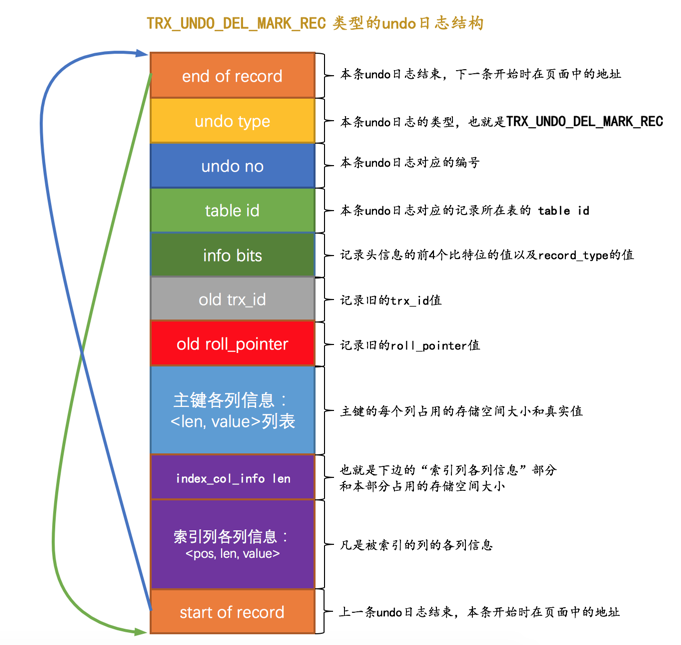

# undo log

## 定義
每当我们要对一条记录做改动时（这里的改动可以指INSERT、DELETE、UPDATE），都需要留一手 —— 把回滚时所需的东西都给记下来。比方说：

- 你插入一条记录时，至少要把这条记录的主键值记下来，之后回滚的时候只需要把这个主键值对应的记录删掉就好了。
- 你删除了一条记录，至少要把这条记录中的内容都记下来，这样之后回滚时再把由这些内容组成的记录插入到表中就好了。
- 你修改了一条记录，至少要把修改这条记录前的旧值都记录下来，这样之后回滚时再把这条记录更新为旧值就好了。

设计数据库的大叔把这些为了回滚而记录的这些东东称之为撤销日志，英文名为undo log

## 事务id

### 给事务分配id的时机
- 对于只读事务来说，只有在它第一次对某个用户创建的临时表执行增、删、改操作时才会为这个事务分配一个事务id，否则的话是不分配事务id的。
- 对于读写事务来说，只有在它第一次对某个表（包括用户创建的临时表）执行增、删、改操作时才会为这个事务分配一个事务id，否则的话也是不分配事务id的。

### 事務ID是怎麼生成的
- 服务器会在内存中维护一个全局变量，每当需要为某个事务分配一个事务id时，就会把该变量的值当作事务id分配给该事务，并且把该变量自增1。
- 每当这个变量的值为256的倍数时，就会将该变量的值刷新到系统表空间的页号为5的页面中一个称之为Max Trx ID的属性处，
这个属性占用8个字节的存储空间。
- 当系统下一次重新启动时，会将上边提到的Max Trx ID属性加载到内存中，将该值加上256之后赋值给我们前边提到的全局变量
（因为在上次关机时该全局变量的值可能大于Max Trx ID属性值）。

## trx_id 等隱藏列
我们前边唠叨InnoDB记录行格式的时候重点强调过：聚簇索引的记录除了会保存完整的用户数据以外，
而且还会自动添加名为trx_id、roll_pointer的隐藏列，
如果用户没有在表中定义主键以及UNIQUE键，还会自动添加一个名为row_id的隐藏列。
所以一条记录在页面中的真实结构看起来就是这样的：

其中的trx_id列其实还蛮好理解的，就是某个对这个聚簇索引记录做改动的语句所在的事务对应的事务id而已（此处的改动可以是INSERT、DELETE、UPDATE操作）。
至于roll_pointer隐藏列我们后边分析～

## undo日誌格式
一个事务在执行过程中可能新增、删除、更新若干条记录，也就是说需要记录很多条对应的undo日志，
这些undo日志会被从0开始编号，也就是说根据生成的顺序分别被称为第0号undo日志、第1号undo日志、...、第n号undo日志等，
这个编号也被称之为undo no。

这些undo日志是被记录到类型为FIL_PAGE_UNDO_LOG（对应的十六进制是0x0002，忘记了页面类型是个啥的同学需要回过头再看看前边的innodb_page章节）的页面中。
这些页面可以从系统表空间中分配，也可以从一种专门存放undo日志的表空间，也就是所谓的undo tablespace中分配。

### INSERT操作对应的undo日志
 
- undo no在一个事务中是从0开始递增的，也就是说只要事务没提交，每生成一条undo日志，那么该条日志的undo no就增1。
- 如果记录中的主键只包含一个列，那么在类型为TRX_UNDO_INSERT_REC的undo日志中只需要把该列占用的存储空间大小和真实值记录下来，
如果记录中的主键包含多个列，那么每个列占用的存储空间大小和对应的真实值都需要记录下来（图中的len就代表列占用的存储空间大小，
value就代表列的真实值）。
    
    
    CREATE TABLE undo_demo (
        id INT NOT NULL,
        key1 VARCHAR(100),
        col VARCHAR(100),
        PRIMARY KEY (id),
        KEY idx_key1 (key1)
    )Engine=InnoDB CHARSET=utf8;

    mysql> select * from information_schema.innodb_sys_tables where name like '%undo_demo%';
    +----------+----------------+------+--------+-------+-------------+------------+---------------+------------+
    | TABLE_ID | NAME           | FLAG | N_COLS | SPACE | FILE_FORMAT | ROW_FORMAT | ZIP_PAGE_SIZE | SPACE_TYPE |
    +----------+----------------+------+--------+-------+-------------+------------+---------------+------------+
    |      291 | test/undo_demo |   33 |      6 |   283 | Barracuda   | Dynamic    |             0 | Single     |
    +----------+----------------+------+--------+-------+-------------+------------+---------------+------------+
    1 row in set (0.01 sec)
    
插入數據後對應的圖

    BEGIN;  # 显式开启一个事务，假设该事务的id为100
    # 插入两条记录
    INSERT INTO undo_demo(id, key1, col) 
        VALUES (1, 'AWM', '狙击枪'), (2, 'M416', '步枪');

#### roll_pointer隱藏列的含義
是时候揭开roll_pointer的真实面纱了，这个占用7个字节的字段其实一点都不神秘，
本质上就是一个指向记录对应的undo日志的一个指针。

### DELETE操作與對應的undo日誌
#### DELETE的過程
我们知道插入到页面中的记录会根据记录头信息中的next_record属性组成一个单向链表，我们把这个链表称之为正常记录链表；
我们在前边唠叨数据页结构的时候说过，被删除的记录其实也会根据记录头信息中的next_record属性组成一个链表，
只不过这个链表中的记录占用的存储空间可以被重新利用，所以也称这个链表为垃圾链表。
Page Header部分有一个称之为PAGE_FREE的属性，它指向由被删除记录组成的垃圾链表中的头节点。

假设现在我们准备使用DELETE语句把正常记录链表中的最后一条记录给删除掉，其实这个删除的过程需要经历两个阶段：

- 阶段一：仅仅将记录的delete_mask标识位设置为1，其他的不做修改（其实会修改记录的trx_id、roll_pointer这些隐藏列的值）。
设计InnoDB的大叔把这个阶段称之为delete mark。

- 阶段二：当该删除语句所在的事务提交之后，会有专门的线程后来真正的把记录删除掉。.所谓真正的删除就是把该记录从正常记录链表中移除，
并且加入到垃圾链表中，然后还要调整一些页面的其他信息，比如页面中的用户记录数量PAGE_N_RECS、上次插入记录的位置PAGE_LAST_INSERT、
垃圾链表头节点的指针PAGE_FREE、页面中可重用的字节数量PAGE_GARBAGE、还有页目录的一些信息等等。
设计InnoDB的大叔把这个阶段称之为purge。

页面的Page Header部分有一个PAGE_GARBAGE属性，该属性记录着当前页面中可重用存储空间占用的总字节数。每当有已删除记录被加入到垃圾链表后，
都会把这个PAGE_GARBAGE属性的值加上该已删除记录占用的存储空间大小。PAGE_FREE指向垃圾链表的头节点，之后每当新插入记录时，
首先判断PAGE_FREE指向的头节点代表的已删除记录占用的存储空间是否足够容纳这条新插入的记录，如果不可以容纳，
就直接向页面中申请新的空间来存储这条记录（是的，你没看错，并不会尝试遍历整个垃圾链表，找到一个可以容纳新记录的节点）。
如果可以容纳，那么直接重用这条已删除记录的存储空间，并且把PAGE_FREE指向垃圾链表中的下一条已删除记录。
但是这里有一个问题，如果新插入的那条记录占用的存储空间大小小于垃圾链表的头节点占用的存储空间大小，
那就意味头节点对应的记录占用的存储空间里有一部分空间用不到，这部分空间就被称之为碎片空间。那这些碎片空间岂不是永远都用不到了么？其实也不是，
这些碎片空间占用的存储空间大小会被统计到PAGE_GARBAGE属性中，这些碎片空间在整个页面快使用完前并不会被重新利用，
不过当页面快满时，如果再插入一条记录，此时页面中并不能分配一条完整记录的空间，
这时候会首先看一看PAGE_GARBAGE的空间和剩余可利用的空间加起来是不是可以容纳下这条记录，如果可以的话，
InnoDB会尝试重新组织页内的记录，重新组织的过程就是先开辟一个临时页面，把页面内的记录依次插入一遍，
因为依次插入时并不会产生碎片，之后再把临时页面的内容复制到本页面，这样就可以把那些碎片空间都解放出来
（很显然重新组织页面内的记录比较耗费性能）。

#### DELETE操作對應的undo日誌
从上边的描述中我们也可以看出来，在删除语句所在的事务提交之前，只会经历阶段一，也就是delete mark阶段

TRX_UNDO_DEL_MARK_REC

    
    BEGIN;  # 显式开启一个事务，假设该事务的id为100
    # 插入两条记录
    INSERT INTO undo_demo(id, key1, col) 
        VALUES (1, 'AWM', '狙击枪'), (2, 'M416', '步枪');
    # 删除一条记录    
    DELETE FROM undo_demo WHERE id = 1; 
    

- 因为这条undo日志是id为100的事务中产生的第3条undo日志，所以它对应的undo no就是2。

- 在对记录做delete mark操作时，记录的trx_id隐藏列的值是100（也就是说对该记录最近的一次修改就发生在本事务中），
所以把100填入old trx_id属性中。然后把记录的roll_pointer隐藏列的值取出来，填入old roll_pointer属性中，
这样就可以通过old roll_pointer属性值找到最近一次对该记录做改动时产生的undo日志。

- 由于undo_demo表中有2个索引：一个是聚簇索引，一个是二级索引idx_key1。只要是包含在索引中的列，
那么这个列在记录中的位置（pos），占用存储空间大小（len）和实际值（value）就需要存储到undo日志中。
    
    - 对于主键来说，只包含一个id列，存储到undo日志中的相关信息分别是：
        
        - pos：id列是主键，也就是在记录的第一个列，它对应的pos值为0。pos占用1个字节来存储。
        - len：id列的类型为INT，占用4个字节，所以len的值为4。len占用1个字节来存储。
        - value：在被删除的记录中id列的值为1，也就是value的值为1。value占用4个字节来存储。
        
    所以对于id列来说，最终存储的结果就是<0, 4, 1>，存储这些信息占用的存储空间大小为1 + 1 + 4 = 6个字节。
    
    - 对于idx_key1来说，只包含一个key1列，存储到undo日志中的相关信息分别是：
    
        - pos：key1列是排在id列、trx_id列、roll_pointer列之后的，它对应的pos值为3。pos占用1个字节来存储。
        - len：key1列的类型为VARCHAR(100)，使用utf8字符集，被删除的记录实际存储的内容是AWM，所以一共占用3个字节，也就是所以len的值为3。len占用1个字节来存储。
        - value：在被删除的记录中key1列的值为AWM，也就是value的值为AWM。value占用3个字节来存储。
        
    所以对于key1列来说，最终存储的结果就是<3, 3, 'AWM'>，存储这些信息占用的存储空间大小为1 + 1 + 3 = 5个字节。
    
 从上边的叙述中可以看到，<0, 4, 1>和<3, 3, 'AWM'>共占用11个字节。然后index_col_info len本身占用2个字节，所以加起来一共占用13个字节，把数字13就填到了index_col_info len的属性中。
 
### UPDATE操作对应的undo日志
在执行UPDATE语句时，InnoDB对更新主键和不更新主键这两种情况有截然不同的处理方案。

#### 不更新主键的情况
- 就地更新（in-place update）

更新记录时，对于被更新的每个列来说，如果更新后的列和更新前的列占用的存储空间都一样大，那么就可以进行就地更新，
也就是直接在原记录的基础上修改对应列的值。

- 先删除掉旧记录，再插入新记录

在不更新主键的情况下，如果有任何一个被更新的列更新前和更新后占用的存储空间大小不一致，
那么就需要先把这条旧的记录从聚簇索引页面中删除掉，然后再根据更新后列的值创建一条新的记录插入到页面中。

我们这里所说的删除并不是delete mark操作，而是真正的删除掉。
不过这里做真正删除操作的线程并不是在唠叨DELETE语句中做purge操作时使用的另外专门的线程，而是由用户线程同步执行真正的删除操作，
真正删除之后紧接着就要根据各个列更新后的值创建的新记录插入。

这里如果新创建的记录占用的存储空间大小不超过旧记录占用的空间，那么可以直接重用被加入到垃圾链表中的旧记录所占用的存储空间，
否则的话需要在页面中新申请一段空间以供新记录使用，如果本页面内已经没有可用的空间的话，那就需要进行页面分裂操作，然后再插入新记录。

TRX_UNDO_UPD_EXIST_REC

- n_updated属性表示本条UPDATE语句执行后将有几个列被更新，后边跟着的<pos, old_len, old_value>
分别表示被更新列在记录中的位置、更新前该列占用的存储空间大小、更新前该列的真实值。
- 如果在UPDATE语句中更新的列包含索引列，那么也会添加索引列各列信息这个部分，否则的话是不会添加这个部分的。

示例    
    
    BEGIN;  # 显式开启一个事务，假设该事务的id为100
    # 插入两条记录
    INSERT INTO undo_demo(id, key1, col) 
        VALUES (1, 'AWM', '狙击枪'), (2, 'M416', '步枪');
    # 删除一条记录    
    DELETE FROM undo_demo WHERE id = 1; 
    # 更新一条记录
    UPDATE undo_demo
        SET key1 = 'M249', col = '机枪'
        WHERE id = 2;

这个UPDATE语句更新的列大小都没有改动，所以可以采用就地更新的方式来执行，在真正改动页面记录时，
会先记录一条类型为TRX_UNDO_UPD_EXIST_REC的undo日志

- 因为这条undo日志是id为100的事务中产生的第4条undo日志，所以它对应的undo no就是3。
- 这条日志的roll_pointer指向undo no为1的那条日志，也就是插入主键值为2的记录时产生的那条undo日志，也就是最近一次对该记录做改动时产生的undo日志。
- 由于本条UPDATE语句中更新了索引列key1的值，所以需要记录一下索引列各列信息部分，也就是把主键和key1列更新前的信息填入。

#### 更新主鍵的情況
- 将旧记录进行delete mark操作

注意：这里是delete mark操作！也就是说在UPDATE语句所在的事务提交前，对旧记录只做一个delete mark操作，
在事务提交后才由专门的线程做purge操作，把它加入到垃圾链表中。
这里一定要和我们上边所说的在不更新记录主键值时，先真正删除旧记录，再插入新记录的方式区分开！

小贴士： 之所以只对旧记录做delete mark操作，是因为别的事务同时也可能访问这条记录，
如果把它真正的删除加入到垃圾链表后，别的事务就访问不到了。这个功能就是所谓的MVCC

- 根据更新后各列的值创建一条新记录，并将其插入到聚簇索引中（需重新定位插入的位置）。

由于更新后的记录主键值发生了改变，所以需要重新从聚簇索引中定位这条记录所在的位置，然后把它插进去。

TRX_UNDO_DEL_MARK_REC->TRX_UNDO_INSERT_REC。
也就是说每对一条记录的主键值做改动时，会记录2条undo日志。

## 这些undo日志会被具体写到什么地方，以及在写入过程中需要注意的一些问题。
這部分感覺對於我來說不重要

[reference](https://juejin.im/book/5bffcbc9f265da614b11b731/section/5c923cf3f265da60fb3bea67)

   