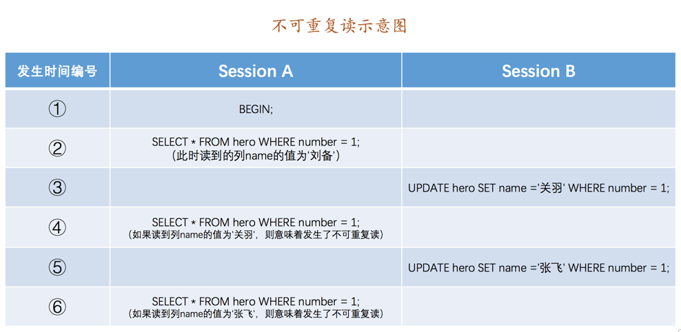

# Transaction Isolation

## 事务隔离级别
我们既想保持事务的隔离性，又想让服务器在处理访问同一数据的多个事务时性能尽量高些，鱼和熊掌不可得兼，舍一部分隔离性而取性能者也。
    
    CREATE TABLE hero (
        number INT,
        name VARCHAR(100),
        country varchar(100),
        PRIMARY KEY (number)
    ) Engine=InnoDB CHARSET=utf8;
    INSERT INTO hero VALUES(1, '刘备', '蜀');

### 事务并发执行遇到的问题
- 脏写（Dirty Write）

如果一个事务修改了另一个未提交事务修改过的数据，那就意味着发生了脏写

前面省略⋯⋯如果在6步驟Session B中的事务进行了回滚，那么Session A中的更新也将不复存在，这种现象就称之为脏写。
这时Session A中的事务就很懵逼，我明明把数据更新了，最后也提交事务了，怎么到最后说自己啥也没干呢？

- 脏读（Dirty Read）

如果一个事务读到了另一个未提交事务修改过的数据，那就意味着发生了脏读

⋯⋯Session A中的事务再去查询这条number为1的记录，如果读到列name的值为'关羽'，
而Session B中的事务稍后进行了回滚，那么Session A中的事务相当于读到了一个不存在的数据，这种现象就称之为脏读。

- 不可重复读（Non-Repeatable Read）

如果一个事务只能读到另一个已经提交的事务修改过的数据，
并且其他事务每对该数据进行一次修改并提交后，该事务都能查询得到最新值，那就意味着发生了不可重复读

我们在Session B中提交了几个隐式事务（注意是隐式事务，意味着语句结束事务就提交了），
这些事务都修改了number列为1的记录的列name的值，每次事务提交之后，如果Session A中的事务都可以查看到最新的值，
这种现象也被称之为不可重复读。

- 幻读（Phantom）

如果一个事务先根据某些条件查询出一些记录，之后另一个事务又向表中插入了符合这些条件的记录，
原先的事务再次按照该条件查询时，能把另一个事务插入的记录也读出来，那就意味着发生了幻读

Session A中的事务先根据条件number > 0这个条件查询表hero，得到了name列值为'刘备'的记录；之后Session B中提交了一个隐式事务，
该事务向表hero中插入了一条新记录；之后Session A中的事务再根据相同的条件number > 0查询表hero，
得到的结果集中包含Session B中的事务新插入的那条记录，这种现象也被称之为幻读。

有的同学会有疑问，那如果Session B中是删除了一些符合number > 0的记录而不是插入新记录，
那Session A中之后再根据number > 0的条件读取的记录变少了，这种现象算不算幻读呢？明确说一下，这种现象不属于幻读，
幻读强调的是一个事务按照某个相同条件多次读取记录时，后读取时读到了之前没有读到的记录。

小贴士： 那对于先前已经读到的记录，之后又读取不到这种情况，算啥呢？其实这相当于对每一条记录都发生了不可重复读的现象。
幻读只是重点强调了读取到了之前读取没有获取到的记录。

### SQL标准中的四种隔离级别
脏写 > 脏读 > 不可重复读 > 幻读

设立一些隔离级别，隔离级别越低，越严重的问题就越可能发生。设立了4个隔离级别：
- READ UNCOMMITTED：未提交读。
- READ COMMITTED：已提交读。
- REPEATABLE READ：可重复读。
- SERIALIZABLE：可串行化。

SQL标准中规定，针对不同的隔离级别，并发事务可以发生不同严重程度的问题

隔离级别	|脏读|	不可重复读|	幻读
----|----|----|----
READ UNCOMMITTED	|Possible|	Possible|	Possible
READ COMMITTED	|Not Possible|	Possible|	Possible
REPEATABLE READ	|Not Possible|	Not Possible|	Possible
SERIALIZABLE	|Not Possible|	Not Possible|	Not Possible

脏写是怎么回事儿？怎么里边都没写呢？这是因为脏写这个问题太严重了，不论是哪种隔离级别，都不允许脏写的情况发生。

### MySQL中支持的四种隔离级别
不同的数据库厂商对SQL标准中规定的四种隔离级别支持不一样，比方说Oracle就只支持READ COMMITTED和SERIALIZABLE隔离级别。
本书中所讨论的MySQL虽然支持4种隔离级别，但与SQL标准中所规定的各级隔离级别允许发生的问题却有些出入，MySQL在REPEATABLE READ隔离级别下，是可以禁止幻读问题的发生的

MySQL的默认隔离级别为REPEATABLE READ，我们可以手动修改一下事务的隔离级别。

#### 如何設置事務隔離級別
    SET [GLOBAL|SESSION] TRANSACTION ISOLATION LEVEL level;
    level: {
         REPEATABLE READ
       | READ COMMITTED
       | READ UNCOMMITTED
       | SERIALIZABLE
    }

- 使用GLOBAL关键字（在全局范围影响）：
    - 只对执行完该语句之后产生的会话起作用。
    - 当前已经存在的会话无效。

- 使用SESSION关键字（在会话范围影响）：
    - 对当前会话的所有后续的事务有效
    - 该语句可以在已经开启的事务中间执行，但不会影响当前正在执行的事务。
    - 如果在事务之间执行，则对后续的事务有效。
    
- 上述两个关键字都不用（只对执行语句后的下一个事务产生影响）：
    - 只对当前会话中下一个即将开启的事务有效。
    - 下一个事务执行完后，后续事务将恢复到之前的隔离级别。
    - 该语句不能在已经开启的事务中间执行，会报错的。

启动服务器时指定了--transaction-isolation=SERIALIZABLE，那么事务的默认隔离级别就从原来的REPEATABLE READ变成了SERIALIZABLE

使用系統變量來查看当前会话默认的隔离级
```
mysql> SHOW VARIABLES LIKE 'transaction_isolation';
+-----------------------+-----------------+
| Variable_name         | Value           |
+-----------------------+-----------------+
| transaction_isolation | REPEATABLE-READ |
+-----------------------+-----------------+
1 row in set (0.01 sec)
```
    
我们也可以使用设置系统变量transaction_isolation的方式来设置事务的隔离级别，不过我们前边介绍过，
一般系统变量只有GLOBAL和SESSION两个作用范围，而这个transaction_isolation却有3个（与上边 SET TRANSACTION ISOLATION LEVEL的语法相对应），
设置语法上有些特殊，更多详情可以
[参见文档](https://dev.mysql.com/doc/refman/5.7/en/server-system-variables.html#sysvar_transaction_isolation) 。
 另外，transaction_isolation是在MySQL 5.7.20的版本中引入来替换tx_isolation的，
 如果你使用的是之前版本的MySQL，请将上述用到系统变量transaction_isolation的地方替换为tx_isolation。

## MVCC原理
### 版本链

实际上insert undo只在事务回滚时起作用，当事务提交后，该类型的undo日志就没用了，它占用的Undo Log Segment也会被系统回收
（也就是该undo日志占用的Undo页面链表要么被重用，要么被释放）。虽然真正的insert undo日志占用的存储空间被释放了，
但是roll_pointer的值并不会被清除，roll_pointer属性占用7个字节，第一个比特位就标记着它指向的undo日志的类型，
如果该比特位的值为1时，就代表着它指向的undo日志类型为insert undo。

假设之后两个事务id分别为100、200的事务对这条记录进行UPDATE操作


能不能在两个事务中交叉更新同一条记录呢？哈哈，这不就是一个事务修改了另一个未提交事务修改过的数据，沦为了脏写了么？
InnoDB使用锁来保证不会有脏写情况的发生，也就是在第一个事务更新了某条记录后，就会给这条记录加锁，
另一个事务再次更新时就需要等待第一个事务提交了，把锁释放之后才可以继续更新。

每次对记录进行改动，都会记录一条undo日志，每条undo日志也都有一个roll_pointer属性
（INSERT操作对应的undo日志没有该属性，因为该记录并没有更早的版本），可以将这些undo日志都连起来，串成一个链表，

对该记录每次更新后，都会将旧值放到一条undo日志中，就算是该记录的一个旧版本，随着更新次数的增多，
所有的版本都会被roll_pointer属性连接成一个链表，我们把这个链表称之为版本链，版本链的头节点就是当前记录最新的值。

### ReadView
对于使用READ UNCOMMITTED隔离级别的事务来说，由于可以读到未提交事务修改过的记录，所以直接读取记录的最新版本就好了；

对于使用SERIALIZABLE隔离级别的事务来说，设计InnoDB的大叔规定使用加锁的方式来访问记录

对于使用READ COMMITTED和REPEATABLE READ隔离级别的事务来说，都必须保证读到已经提交了的事务修改过的记录，
也就是说假如另一个事务已经修改了记录但是尚未提交，是不能直接读取最新版本的记录的，
核心问题就是：需要判断一下版本链中的哪个版本是当前事务可见的。为此，设计InnoDB的大叔提出了一个ReadView的概念，
这个ReadView中主要包含4个比较重要的内容：

- m_ids：表示在生成ReadView时当前系统中活跃的读写事务的事务id列表。
- min_trx_id：表示在生成ReadView时当前系统中活跃的读写事务中最小的事务id，也就是m_ids中的最小值。
- max_trx_id：表示生成ReadView时系统中应该分配给下一个事务的id值。


    小贴士： 注意max_trx_id并不是m_ids中的最大值，事务id是递增分配的。比方说现在有id为1，2，3这三个事务，之后id为3的事务提交了。
    那么一个新的读事务在生成ReadView时，m_ids就包括1和2，min_trx_id的值就是1，max_trx_id的值就是4。

- creator_trx_id：表示生成该ReadView的事务的事务id。


    小贴士： 我们前边说过，只有在对表中的记录做改动时（执行INSERT、DELETE、UPDATE这些语句时）才会为事务分配事务id，
    否则在一个只读事务中的事务id值都默认为0。

有了这个ReadView，这样在访问某条记录时，只需要按照下边的步骤判断记录的某个版本是否可见：

- 如果被访问版本的trx_id属性值与ReadView中的creator_trx_id值相同，意味着当前事务在访问它自己修改过的记录，
所以该版本可以被当前事务访问。

- 如果被访问版本的trx_id属性值小于ReadView中的min_trx_id值，表明生成该版本的事务在当前事务生成ReadView前已经提交，
所以该版本可以被当前事务访问。

- 如果被访问版本的trx_id属性值大于或等于ReadView中的max_trx_id值，表明生成该版本的事务在当前事务生成ReadView后才开启，
所以该版本不可以被当前事务访问。

- 如果被访问版本的trx_id属性值在ReadView的min_trx_id和max_trx_id之间，那就需要判断一下trx_id属性值是不是在m_ids列表中，
如果在，说明创建ReadView时生成该版本的事务还是活跃的，该版本不可以被访问；
如果不在，说明创建ReadView时生成该版本的事务已经被提交，该版本可以被访问。

如果某个版本的数据对当前事务不可见的话，那就顺着版本链找到下一个版本的数据，继续按照上边的步骤判断可见性，
依此类推，直到版本链中的最后一个版本。如果最后一个版本也不可见的话，那么就意味着该条记录对该事务完全不可见，查询结果就不包含该记录。

在MySQL中，READ COMMITTED和REPEATABLE READ隔离级别的的一个非常大的区别就是它们生成ReadView的时机不同。
#### READ COMMITTED —— 每次读取数据前都生成一个ReadView
    # Transaction 100
    BEGIN;
    UPDATE hero SET name = '关羽' WHERE number = 1;
    UPDATE hero SET name = '张飞' WHERE number = 1;
    
    # Transaction 200
    BEGIN;
    # 更新了一些别的表的记录
    ...


假设现在有一个使用READ COMMITTED隔离级别的事务开始执行：
    
    # 使用READ COMMITTED隔离级别的事务
    BEGIN;
    # SELECT1：Transaction 100、200未提交
    SELECT * FROM hero WHERE number = 1; # 得到的列name的值为'刘备'

这个SELECT1的执行过程如下：

- 在执行SELECT语句时会先生成一个ReadView，ReadView的
m_ids列表的内容就是[100, 200]，
min_trx_id为100，
max_trx_id为201，
creator_trx_id为0。
- 然后从版本链中挑选可见的记录，从图中可以看出，最新版本的列name的内容是'张飞'，该版本的
trx_id值为100，在m_ids列表内，所以不符合可见性要求，根据roll_pointer跳到下一个版本。
- 下一个版本的列name的内容是'关羽'，该版本的trx_id值也为100，也在m_ids列表内，所以也不符合要求，继续跳到下一个版本。
- 下一个版本的列name的内容是'刘备'，该版本的
trx_id值为80，小于ReadView中的min_trx_id值100，
所以这个版本是符合要求的，最后返回给用户的版本就是这条列name为'刘备'的记录。

之后，我们把事务id为100的事务提交一下，就像这样：
    
    # Transaction 100
    BEGIN;
    UPDATE hero SET name = '关羽' WHERE number = 1;
    UPDATE hero SET name = '张飞' WHERE number = 1;
    COMMIT;

然后再到事务id为200的事务中更新一下表hero中number为1的记录：
    
    # Transaction 200
    BEGIN;
    # 更新了一些别的表的记录
    ...
    UPDATE hero SET name = '赵云' WHERE number = 1;
    UPDATE hero SET name = '诸葛亮' WHERE number = 1;


然后再到刚才使用READ COMMITTED隔离级别的事务中继续查找这个number为1的记录，如下：
    
    # 使用READ COMMITTED隔离级别的事务
    BEGIN;
    
    # SELECT1：Transaction 100、200均未提交
    SELECT * FROM hero WHERE number = 1; # 得到的列name的值为'刘备'
    
    # SELECT2：Transaction 100提交，Transaction 200未提交
    SELECT * FROM hero WHERE number = 1; # 得到的列name的值为'张飞'

这个SELECT2的执行过程如下：

- 在执行SELECT语句时又会单独生成一个ReadView，该ReadView的
m_ids列表的内容就是[200]（事务id为100的那个事务已经提交了，所以再次生成快照时就没有它了），
min_trx_id为200，
max_trx_id为201，
creator_trx_id为0。

- 然后从版本链中挑选可见的记录，从图中可以看出，最新版本的列name的内容是'诸葛亮'，
该版本的trx_id值为200，在m_ids列表内，所以不符合可见性要求，根据roll_pointer跳到下一个版本。

- 下一个版本的列name的内容是'赵云'，该版本的trx_id值为200，也在m_ids列表内，所以也不符合要求，继续跳到下一个版本。

- 下一个版本的列name的内容是'张飞'，
该版本的trx_id值为100，小于ReadView中的min_trx_id值200，
所以这个版本是符合要求的，最后返回给用户的版本就是这条列name为'张飞'的记录。

#### REPEATABLE READ —— 在第一次读取数据时生成一个ReadView
对于使用REPEATABLE READ隔离级别的事务来说，只会在第一次执行查询语句时生成一个ReadView，之后的查询就不会重复生成了。

上面的SELECT2的执行过程如下：

- 在执行SELECT语句时不会单独生成一个ReadView，復用第一次的，该ReadView的
m_ids列表的内容就是[100,200]（事务id为100的那个事务已经提交了，所以再次生成快照时就没有它了），
min_trx_id为100，
max_trx_id为201，
creator_trx_id为0。

- 然后从版本链中挑选可见的记录，从图中可以看出，最新版本的列name的内容是'诸葛亮'，
该版本的trx_id值为200，在m_ids列表内，所以不符合可见性要求，根据roll_pointer跳到下一个版本。

- 下一个版本的列name的内容是'赵云'，该版本的trx_id值为200，也在m_ids列表内，所以也不符合要求，继续跳到下一个版本。

- 下一个版本的列name的内容是'张飞'，
该版本的trx_id值为100，在m_ids列表内，所以不符合可见性要求，根据roll_pointer跳到下一个版本。
......
- 下一个版本的列name的内容是'刘备'，该版本的
trx_id值为80，小于ReadView中的min_trx_id值100，
所以这个版本是符合要求的，最后返回给用户的版本就是这条列name为'刘备'的记录。

也就是说两次SELECT查询得到的结果是重复的，记录的列c值都是'刘备'，这就是可重复读的含义。
如果我们之后再把事务id为200的记录提交了，然后再到刚才使用REPEATABLE READ隔离级别的事务中继续查找这个number为1的记录，
得到的结果还是'刘备'，具体执行过程大家可以自己分析一下。

### MVCC小结
所谓的MVCC（Multi-Version Concurrency Control ，多版本并发控制）
指的就是在使用READ COMMITTD、REPEATABLE READ这两种隔离级别的事务在执行普通的SELECT操作时访问记录的版本链的过程，
这样子可以使不同事务的读-写、写-读操作并发执行，从而提升系统性能。

我们之前说执行DELETE语句或者更新主键的UPDATE语句并不会立即把对应的记录完全从页面中删除，而是执行一个所谓的delete mark操作，
相当于只是对记录打上了一个删除标志位，这主要就是为MVCC服务的，大家可以对比上边举的例子自己试想一下怎么使用。
 另外，所谓的MVCC只是在我们进行普通的SEELCT查询时才生效，截止到目前我们所见的所有SELECT语句都算是普通的查询，
 至于啥是个不普通的查询，我们稍后再说哈～

## 关于purge
- 我们说insert undo在事务提交之后就可以被释放掉了，而update undo由于还需要支持MVCC，不能立即删除掉。
- 为了支持MVCC，对于delete mark操作来说，仅仅是在记录上打一个删除标记，并没有真正将它删除掉。

随着系统的运行，在确定系统中包含最早产生的那个ReadView的事务不会再访问某些update undo日志以及被打了删除标记的记录后，
有一个后台运行的purge线程会把它们真正的删除掉。


