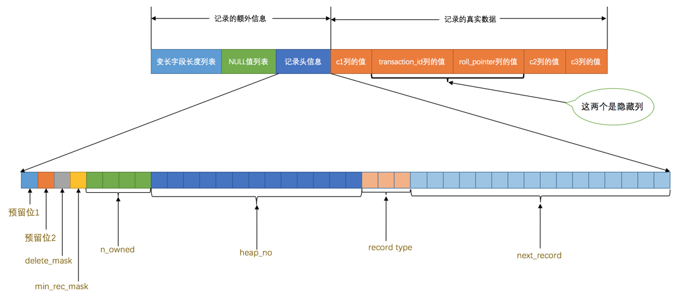
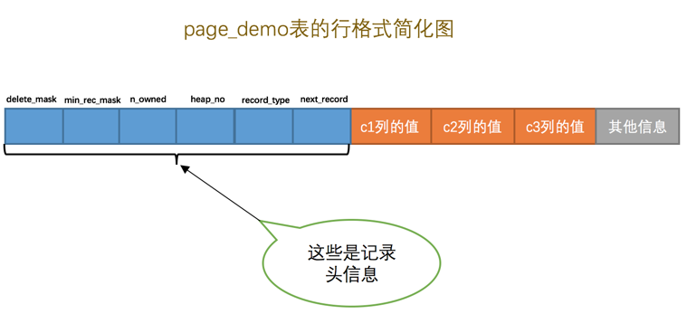
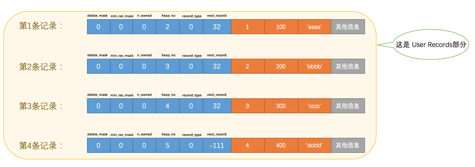
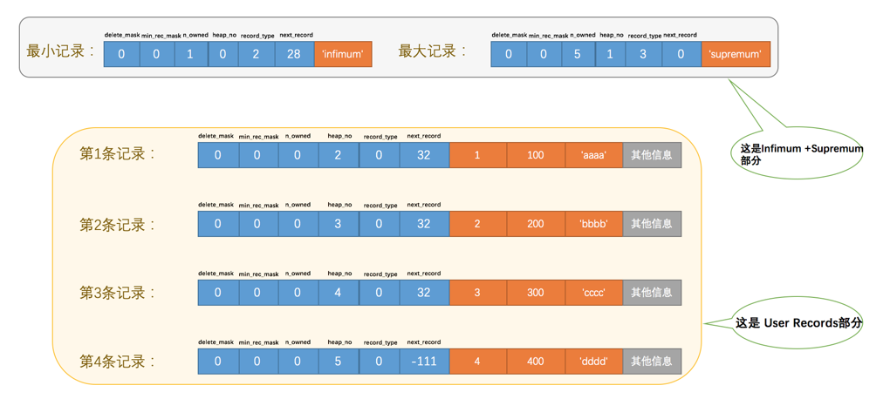
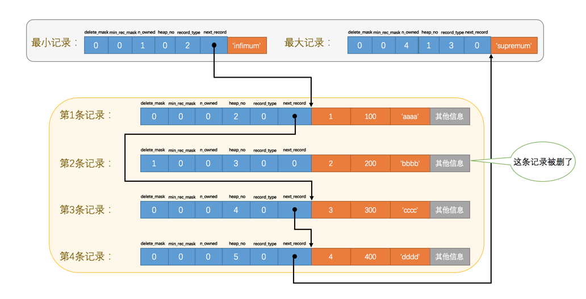
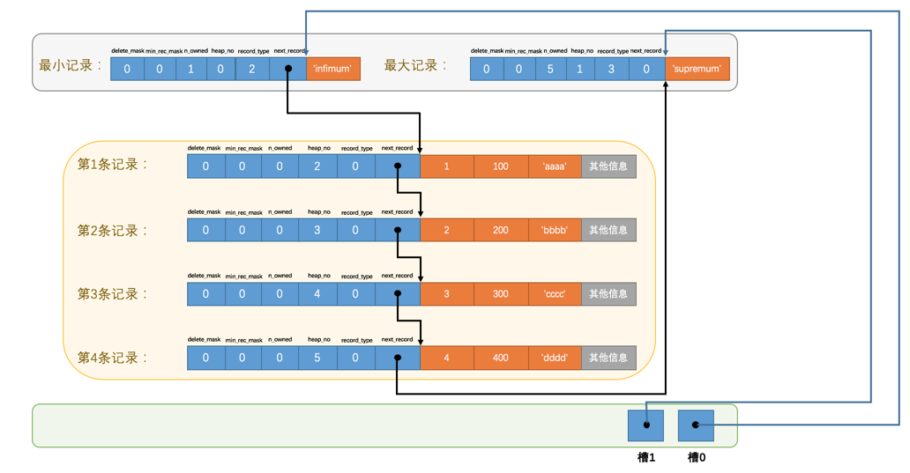
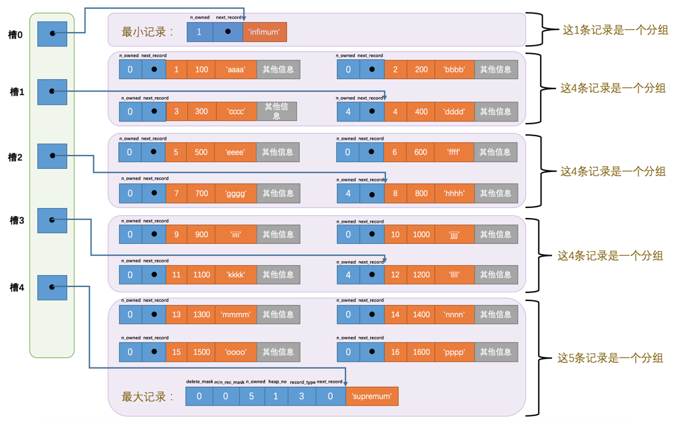

# innodb page

## 紀錄在頁中的存儲
- File Header，表示页的一些通用信息，占固定的38字节。
- Page Header，表示数据页专有的一些信息，占固定的56个字节。
- Infimum + Supremum，两个虚拟的伪记录，分别表示页中的最小和最大记录，占固定的26个字节。
- User Records：真实存储我们插入的记录的部分，大小不固定。
- Free Space：页中尚未使用的部分，大小不确定。
- Page Directory：页中的某些记录相对位置，也就是各个槽在页面中的地址偏移量，大小不固定，插入的记录越多，这个部分占用的空间越多。
- File Trailer：用于检验页是否完整的部分，占用固定的8个字节。

## User Records + 下界/上界（infimum/supremum）
    mysql> CREATE TABLE page_demo(c1 INT,c2 INT,c3 VARCHAR(10000),PRIMARY KEY (c1)) CHARSET=ascii ROW_FORMAT=Compact;
    Query OK, 0 rows affected (0.04 sec)
    
    mysql> INSERT INTO page_demo VALUES(1, 100, 'aaaa'), (2, 200, 'bbbb'), (3, 300, 'cccc'), (4, 400, 'dddd');
    Query OK, 4 rows affected (0.02 sec)
    Records: 4  Duplicates: 0  Warnings: 0
    
    mysql> select * from page_demo;
    +----+------+------+
    | c1 | c2   | c3   |
    +----+------+------+
    |  1 |  100 | aaaa |
    |  2 |  200 | bbbb |
    |  3 |  300 | cccc |
    |  4 |  400 | dddd |
    +----+------+------+
    4 rows in set (0.01 sec)

 ### 行格式紀錄頭信息
|名称|	大小（单位：bit）|	描述|
| ---- | ---- | ---- |
|预留位1|	1|	没有使用|
预留位2	|1	|没有使用|
delete_mask|	1|	标记该记录是否被删除
min_rec_mask	|1|	B+树的每层非叶子节点中的最小记录都会添加该标记
n_owned	|4|	表示当前记录組拥有的记录数，不在槽slot上的紀錄的n_owned為0
heap_no	|13|	表示当前记录在记录堆的位置信息
record_type	|3|	表示当前记录的类型，0表示普通记录，1表示B+树非叶子节点记录，2表示最小记录，3表示最大记录
next_record	|16|	表示下一条记录的相对位置

- delete_mask
这个属性标记着当前记录是否被删除，占用1个二进制位，值为0的时候代表记录并没有被删除，为1的时候代表记录被删除掉了。

这些被删除的记录之所以不立即从磁盘上移除，是因为移除它们之后把其他的记录在磁盘上重新排列需要性能消耗，
所以只是打一个删除标记而已，所有被删除掉的记录都会组成一个所谓的垃圾链表，在这个链表中的记录占用的空间称之为所谓的可重用空间，
之后如果有新记录插入到表中的话，可能把这些被删除的记录占用的存储空间覆盖掉。

- heap_no
这个属性表示当前记录在本页中的位置，从图中可以看出来，我们插入的4条记录在本页中的位置分别是：2、3、4、5。是不是少了点啥？是的，怎么不见heap_no值为0和1的记录呢？

这其实是设计InnoDB的大叔们玩的一个小把戏，他们自动给每个页里边儿加了两个记录，由于这两个记录并不是我们自己插入的，所以有时候也称为伪记录或者虚拟记录。这两个伪记录一个代表最小记录，一个代表最大记录.

对于一条完整的记录来说，比较记录的大小就是比较主键的大小。比方说我们插入的4行记录的主键值分别是：1、2、3、4，这也就意味着这4条记录的大小从小到大依次递增。

- next_record
这玩意儿非常重要，它表示从当前记录的真实数据到下一条记录的真实数据的地址偏移量。
比方说第一条记录的next_record值为32，意味着从第一条记录的真实数据的地址处向后找32个字节便是下一条记录的真实数据。
如果你熟悉数据结构的话，就立即明白了，这其实是个链表，可以通过一条记录找到它的下一条记录。
但是需要注意注意再注意的一点是，下一条记录指得并不是按照我们插入顺序的下一条记录，而是按照主键值由小到大的顺序的下一条记录。
而且规定 Infimum记录（也就是最小记录） 的下一条记录就是本页中主键值最小的用户记录，而本页中主键值最大的用户记录的下一条记录就是 Supremum记录（也就是最大记录） ，
为了更形象的表示一下这个next_record起到的作用，我们用箭头来替代一下next_record中的地址偏移量：

从图中可以看出来，我们的记录按照主键从小到大的顺序形成了一个单链表。最大记录的next_record的值为0，这也就是说最大记录是没有下一条记录了，它是这个单链表中的最后一个节点。

删掉第2条记录后的示意图就是：

- 第2条记录并没有从存储空间中移除，而是把该条记录的delete_mask值设置为1。
- 第2条记录的next_record值变为了0，意味着该记录没有下一条记录了。
- 第1条记录的next_record指向了第3条记录。
- 最大记录的n_owned值从5变成了4。

你会不会觉得next_record这个指针有点儿怪，为啥要指向记录头信息和真实数据之间的位置呢？
为啥不干脆指向整条记录的开头位置，也就是记录的额外信息开头的位置呢？ 
因为这个位置刚刚好，向左读取就是记录头信息，向右读取就是真实数据。
我们前边还说过变长字段长度列表、NULL值列表中的信息都是逆序存放，这样可以使记录中位置靠前的字段和它们对应的字段长度信息在内存中的距离更近，可能会提高高速缓存的命中率。

## 頁的查找-page directory(頁目錄)
頁的存儲
- 将所有正常的记录（包括最大和最小记录，不包括标记为已删除的记录）划分为几个组。
- 每个组的最后一条记录（也就是组内最大的那条记录）的头信息中的n_owned属性表示该组内共有几条记录。
- 将每个组的最后一条记录的地址偏移量单独提取出来按顺序存储到靠近页的尾部的地方，这个地方就是所谓的Page Directory，也就是页目录。
页面目录中的这些地址偏移量被称为槽（英文名：Slot），所以这个页面目录就是由槽组成的。

比方说现在的page_demo表中正常的记录共有6条，InnoDB会把它们分成两组，第一组中只有一个最小记录，第二组中是剩余的5条记录

- 初始情况下一个数据页里只有最小记录和最大记录两条记录，它们分属于两个分组。
- 之后每插入一条记录，都会从页目录中找到主键值比本记录的主键值大并且差值最小的槽，然后把该槽对应的记录的n_owned值加1，表示本组内又添加了一条记录，直到该组中的记录数等于8个。
- 在一个组中的记录数等于8个后再插入一条记录时，会将组中的记录拆分成两个组，一个组中4条记录，另一个5条记录。这个过程会在页目录中新增一个槽来记录这个新增分组中最大的那条记录的偏移量。

當插入多行紀錄之後的分組

    mysql> INSERT INTO page_demo VALUES(5, 500, 'eeee'), (6, 600, 'ffff'), (7, 700, 'gggg'), (8, 800, 'hhhh'), (9, 900, 'iiii'), (10, 1000, 'jjjj'), (11, 1100, 'kkkk'), (12, 1200, 'llll'), (13, 1300, 'mmmm'), (14, 1400, 'nnnn'), (15, 1500, 'oooo'), (16, 1600, 'pppp');
    Query OK, 12 rows affected (0.00 sec)
    Records: 12  Duplicates: 0  Warnings: 0

這時候使用二分法查找，比方说我们想找主键值为6的记录，过程是这样的：

- 计算中间槽的位置：(0+4)/2=2，所以查看槽2对应记录的主键值为8，又因为8 > 6，所以设置high=2，low保持不变。
- 重新计算中间槽的位置：(0+2)/2=1，所以查看槽1对应的主键值为4，又因为4 < 6，所以设置low=1，high保持不变。
- 因为high - low的值为1，所以确定主键值为6的记录在槽2对应的组中。此刻我们需要找到槽2中主键值最小的那条记录，然后沿着单向链表遍历槽2中的记录。但是我们前边又说过，每个槽对应的记录都是该组中主键值最大的记录，这里槽2对应的记录是主键值为8的记录，怎么定位一个组中最小的记录呢？别忘了各个槽都是挨着的，我们可以很轻易的拿到槽1对应的记录（主键值为4），该条记录的下一条记录就是槽2中主键值最小的记录，该记录的主键值为5。所以我们可以从这条主键值为5的记录出发，遍历槽2中的各条记录，直到找到主键值为6的那条记录即可。由于一个组中包含的记录条数只能是1~8条，所以遍历一个组中的记录的代价是很小的。

## Page Header（页面头部）
设计InnoDB的大叔们为了能得到一个数据页中存储的记录的状态信息，比如本页中已经存储了多少条记录，第一条记录的地址是什么，页目录中存储了多少个槽等等，
特意在页中定义了一个叫Page Header的部分，这个部分占用固定的56个字节，专门存储各种状态信息，具体各个字节的作用看下表：

名称	|占用空间大小|描述
----|----|:----|
PAGE_N_DIR_SLOTS|	2字节|	在页目录中的槽数量
PAGE_HEAP_TOP	|2字节|	还未使用的空间最小地址，也就是说从该地址之后就是Free Space
PAGE_N_HEAP	|2字节|	本页中的记录的数量（包括最小和最大记录以及标记为删除的记录）
PAGE_FREE	|2字节|	第一个已经标记为删除的记录地址（各个已删除的记录通过next_record也会组成一个单链表，这个单链表中的记录可以被重新利用）
PAGE_GARBAGE	|2字节|	已删除记录占用的字节数
PAGE_LAST_INSERT	|2字节|	最后插入记录的位置
PAGE_DIRECTION	|2字节|	记录插入的方向
PAGE_N_DIRECTION	|2字节|	一个方向连续插入的记录数量
PAGE_N_RECS	|2字节|	该页中记录的数量（不包括最小和最大记录以及被标记为删除的记录）
PAGE_MAX_TRX_ID	|8字节|	修改当前页的最大事务ID，该值仅在二级索引中定义
PAGE_LEVEL	|2字节|	当前页在B+树中所处的层级
PAGE_INDEX_ID	|8字节|	索引ID，表示当前页属于哪个索引
PAGE_BTR_SEG_LEAF	|10字节|	B+树叶子段的头部信息，仅在B+树的Root页定义
PAGE_BTR_SEG_TOP	|10字节|	B+树非叶子段的头部信息，仅在B+树的Root页定义

- PAGE_DIRECTION

假如新插入的一条记录的主键值比上一条记录的主键值大，我们说这条记录的插入方向是右边，反之则是左边。用来表示最后一条记录插入方向的状态就是PAGE_DIRECTION。

- PAGE_N_DIRECTION

假设连续几次插入新记录的方向都是一致的，InnoDB会把沿着同一个方向插入记录的条数记下来，这个条数就用PAGE_N_DIRECTION这个状态表示。当然，如果最后一条记录的插入方向改变了的话，这个状态的值会被清零重新统计。

## File Header(文件頭部)
上边唠叨的Page Header是专门针对数据页记录的各种状态信息，比方说页里头有多少个记录了呀，有多少个槽了呀。
我们现在描述的File Header针对各种类型的页都通用，也就是说不同类型的页都会以File Header作为第一个组成部分，
它描述了一些针对各种页都通用的一些信息，比方说这个页的编号是多少，它的上一个页、下一个页是谁啦吧啦吧啦～ 这个部分占用固定的38个字节，
是由下边这些内容组成的：

名称	|占用空间大小|	描述
----|----|----
FIL_PAGE_SPACE_OR_CHKSUM	|4字节|	页的校验和（checksum值）
FIL_PAGE_OFFSET	|4字节|	页号
FIL_PAGE_PREV	|4字节|	上一个页的页号
FIL_PAGE_NEXT	|4字节|	下一个页的页号
FIL_PAGE_LSN	|8字节|	页面被最后修改时对应的日志序列位置（英文名是：Log Sequence Number）
FIL_PAGE_TYPE	|2字节|	该页的类型
FIL_PAGE_FILE_FLUSH_LSN	|8字节|	仅在系统表空间的一个页中定义，代表文件至少被刷新到了对应的LSN值
FIL_PAGE_ARCH_LOG_NO_OR_SPACE_ID	|4字节|	页属于哪个表空间

- FIL_PAGE_SPACE_OR_CHKSUM

这个代表当前页面的校验和（checksum）。啥是个校验和？就是对于一个很长很长的字节串来说，我们会通过某种算法来计算一个比较短的值来代表这个很长的字节串，这个比较短的值就称为校验和。这样在比较两个很长的字节串之前先比较这两个长字节串的校验和，如果校验和都不一样两个长字节串肯定是不同的，所以省去了直接比较两个比较长的字节串的时间损耗。

- FIL_PAGE_OFFSET

每一个页都有一个单独的页号，就跟你的身份证号码一样，InnoDB通过页号来可以唯一定位一个页。

- FIL_PAGE_TYPE

这个代表当前页的类型，我们前边说过，InnoDB为了不同的目的而把页分为不同的类型，我们上边介绍的其实都是存储记录的数据页，其实还有很多别的类型的页，具体如下表：

类型名称	|十六进制|	描述
----|----|----
FIL_PAGE_TYPE_ALLOCATED	|0x0000|	最新分配，还没使用
FIL_PAGE_UNDO_LOG	|0x0002|	Undo日志页
FIL_PAGE_INODE	|0x0003|	段信息节点
FIL_PAGE_IBUF_FREE_LIST	|0x0004|	Insert Buffer空闲列表
FIL_PAGE_IBUF_BITMAP	|0x0005|	Insert Buffer位图
FIL_PAGE_TYPE_SYS	|0x0006|	系统页
FIL_PAGE_TYPE_TRX_SYS	|0x0007|	事务系统数据
FIL_PAGE_TYPE_FSP_HDR	|0x0008|	表空间头部信息
FIL_PAGE_TYPE_XDES	|0x0009|	扩展描述页
FIL_PAGE_TYPE_BLOB	|0x000A|	溢出页
FIL_PAGE_INDEX	|0x45BF|	索引页，也就是我们所说的数据页

我们存放记录的数据页的类型其实是FIL_PAGE_INDEX，也就是所谓的索引页。

- FIL_PAGE_PREV和FIL_PAGE_NEXT

我们前边强调过，InnoDB都是以页为单位存放数据的，有时候我们存放某种类型的数据占用的空间非常大（比方说一张表中可以有成千上万条记录），InnoDB可能不可以一次性为这么多数据分配一个非常大的存储空间，
如果分散到多个不连续的页中存储的话需要把这些页关联起来，FIL_PAGE_PREV和FIL_PAGE_NEXT就分别代表本页的上一个和下一个页的页号。
这样通过建立一个双向链表把许许多多的页就都串联起来了，而无需这些页在物理上真正连着。需要注意的是，并不是所有类型的页都有上一个和下一个页的属性，
不过我们本集中唠叨的数据页（也就是类型为FIL_PAGE_INDEX的页）是有这两个属性的，所以所有的数据页其实是一个双链表.

## File Trailer(文件尾部)
我们知道InnoDB存储引擎会把数据存储到磁盘上，但是磁盘速度太慢，需要以页为单位把数据加载到内存中处理，如果该页中的数据在内存中被修改了，那么在修改后的某个时间需要把数据同步到磁盘中。但是在同步了一半的时候中断电了咋办，这不是莫名尴尬么？为了检测一个页是否完整（也就是在同步的时候有没有发生只同步一半的尴尬情况），设计InnoDB的大叔们在每个页的尾部都加了一个File Trailer部分，这个部分由8个字节组成，可以分成2个小部分：

- 前4个字节代表页的校验和

这个部分是和File Header中的校验和相对应的。每当一个页面在内存中修改了，在同步之前就要把它的校验和算出来，因为File Header在页面的前边，所以校验和会被首先同步到磁盘，当完全写完时，校验和也会被写到页的尾部，如果完全同步成功，则页的首部和尾部的校验和应该是一致的。如果写了一半儿断电了，那么在File Header中的校验和就代表着已经修改过的页，而在File Trailer中的校验和代表着原先的页，二者不同则意味着同步中间出了错。

- 后4个字节代表页面被最后修改时对应的日志序列位置（LSN）

这个部分也是为了校验页的完整性的，只不过我们目前还没说LSN是个什么意思，所以大家可以先不用管这个属性。

这个File Trailer与File Header类似，都是所有类型的页通用的。
