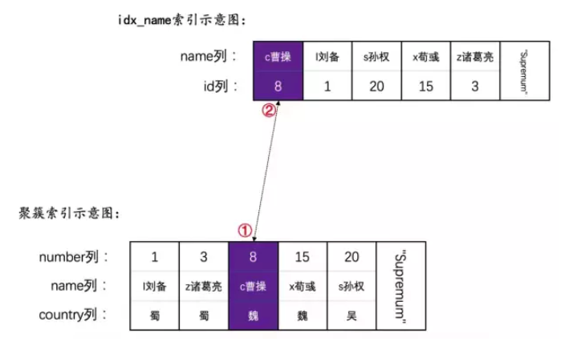
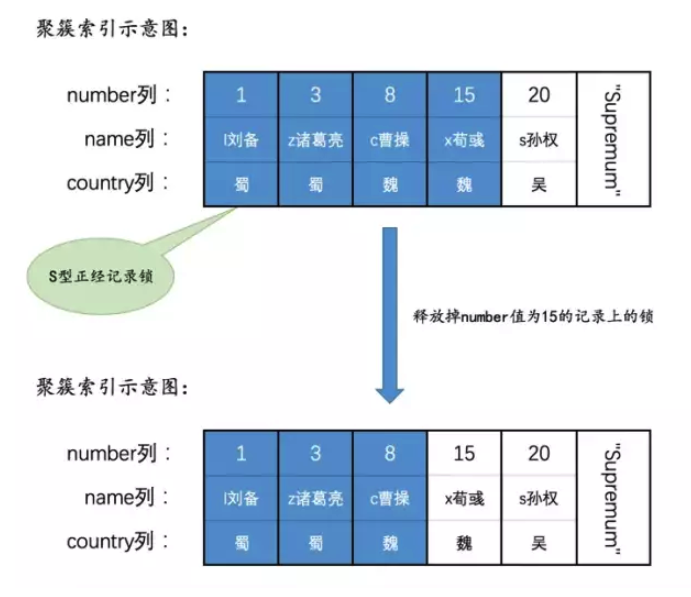
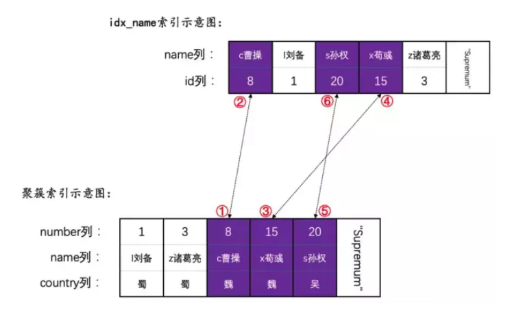
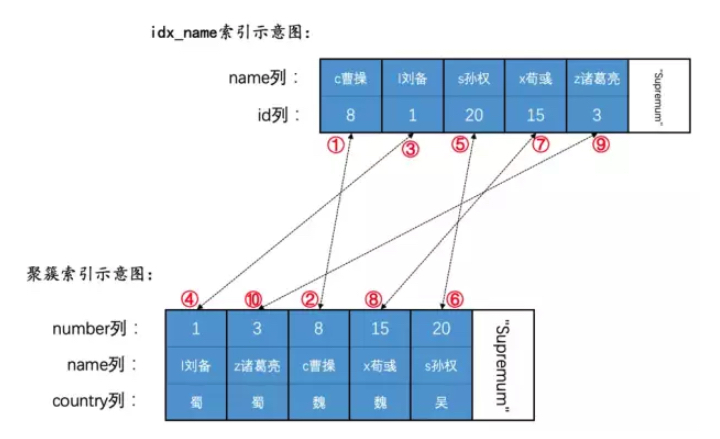
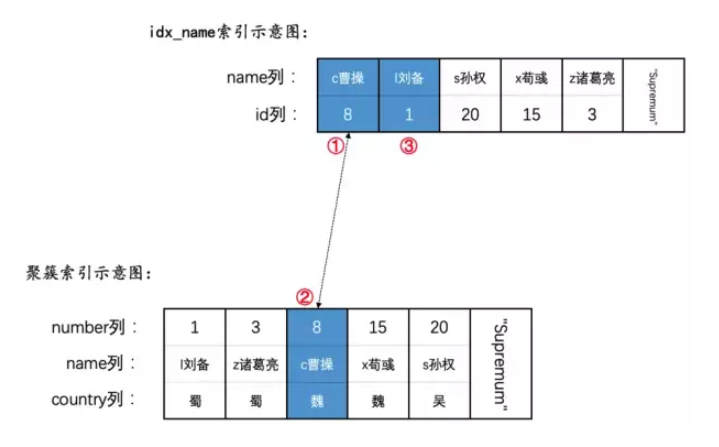
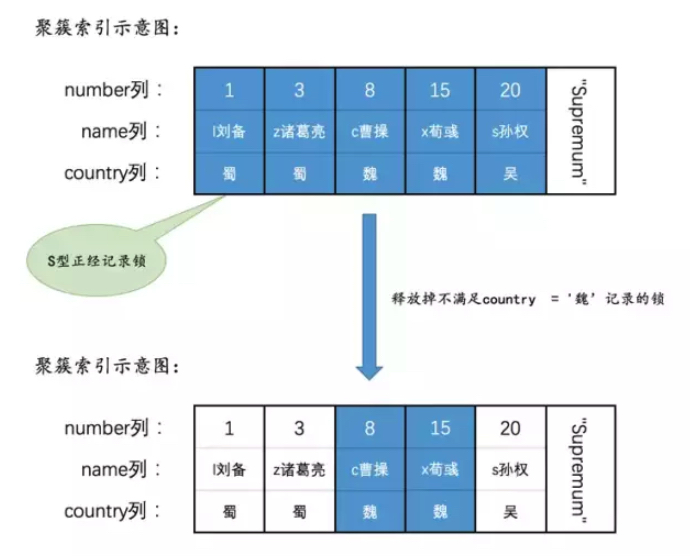

# sql lock analysis

## 事前准备
    CREATE TABLE hero (
        number INT,
        name VARCHAR(100),
        country varchar(100),
        PRIMARY KEY (number),
        KEY idx_name (name)
    ) Engine=InnoDB CHARSET=utf8;

    INSERT INTO hero VALUES
        (1, 'l刘备', '蜀'),
        (3, 'z诸葛亮', '蜀'),
        (8, 'c曹操', '魏'),
        (15, 'x荀彧', '魏'),
        (20, 's孙权', '吴');

## 语句加锁分析
把语句分为3种大类：普通的SELECT语句、锁定读的语句、INSERT语句，我们分别看一下。

## 普通的SELECT语句
### REPEATABLE READ隔离级别下, InnoDB中的MVCC并不能完完全全的禁止幻读。
    # 事务T1，REPEATABLE READ隔离级别下
    mysql> SHOW VARIABLES LIKE 'autocommit';
    +---------------+-------+
    | Variable_name | Value |
    +---------------+-------+
    | autocommit    | ON    |
    +---------------+-------+
    1 row in set (0.01 sec)
    mysql> SHOW VARIABLES LIKE 'transaction_isolation';
    +-----------------------+-----------------+
    | Variable_name         | Value           |
    +-----------------------+-----------------+
    | transaction_isolation | REPEATABLE-READ |
    +-----------------------+-----------------+
    1 row in set (0.03 sec)

    mysql> BEGIN;
    Query OK, 0 rows affected (0.00 sec)
    
    mysql> SELECT * FROM hero WHERE number = 30;
    Empty set (0.01 sec)
    
    # 此时事务T2执行了：INSERT INTO hero VALUES(30, 'g关羽', '魏'); 并提交
    
    mysql> select * from hero;
    +--------+------------+---------+
    | number | name       | country |
    +--------+------------+---------+
    |      1 | l刘备      | 蜀      |
    |      3 | z诸葛亮    | 蜀      |
    |      8 | c曹操      | 魏      |
    |     15 | x荀彧      | 魏      |
    |     20 | s孙权      | 吴      |
    +--------+------------+---------+
    
    mysql> UPDATE hero SET country = '蜀' WHERE number = 30;
    Query OK, 1 row affected (0.01 sec)
    Rows matched: 1  Changed: 1  Warnings: 0
    
    mysql> SELECT * FROM hero WHERE number = 30;
    +--------+---------+---------+
    | number | name    | country |
    +--------+---------+---------+
    |     30 | g关羽   | 蜀      |
    +--------+---------+---------+
    1 row in set (0.01 sec)

在REPEATABLE READ隔离级别下，T1第一次执行普通的SELECT语句时生成了一个ReadView，之后T2向hero表中新插入了一条记录便提交了，
ReadView并不能阻止T1执行UPDATE或者DELETE语句来对改动这个新插入的记录（因为T2已经提交，改动该记录并不会造成阻塞），
但是这样一来这条新记录的trx_id隐藏列就变成了T1的事务id，之后T1中再使用普通的SELECT语句去查询这条记录时就可以看到这条记录了，
也就把这条记录返回给客户端了

### SERIALIZABLE隔离级别下，需要分为两种情况讨论：
- 在系统变量autocommit=0时，也就是禁用自动提交时，普通的SELECT语句会被转为SELECT ... LOCK IN SHARE MODE这样的语句，
也就是在读取记录前需要先获得记录的S锁，具体的加锁情况和REPEATABLE READ隔离级别下一样，我们后边再分析。
- 在系统变量autocommit=1时，也就是启用自动提交时，普通的SELECT语句并不加锁，只是利用MVCC来生成一个ReadView去读取记录。

    为啥不加锁呢？因为启用自动提交意味着一个事务中只包含一条语句，一条语句也就没有啥不可重复读、幻读这样的问题了。

## 锁定读的语句
我们把下边四种语句放到一起讨论：

- 语句一：SELECT ... LOCK IN SHARE MODE;
- 语句二：SELECT ... FOR UPDATE;
- 语句三：UPDATE ...
- 语句四：DELETE ...

我们说语句一和语句二是MySQL中规定的两种锁定读的语法格式，而语句三和语句四由于在执行过程需要首先定位到被改动的记录并给记录加锁，
也可以被认为是一种锁定读。

### READ UNCOMMITTED/READ COMMITTED隔离级别下
在READ UNCOMMITTED下语句的加锁方式和READ COMMITTED隔离级别下语句的加锁方式基本一致，所以就放到一块儿说了。
值得注意的是，采用加锁方式解决并发事务带来的问题时，其实脏读和不可重复读在任何一个隔离级别下都不会发生（因为读-写操作需要排队进行）。

### 对于使用主键进行等值查询的情况
- 使用SELECT ... LOCK IN SHARE MODE来为记录加锁，比方说：
  
  ```SELECT * FROM hero WHERE number = 8 LOCK IN SHARE MODE;```
  
  这个语句执行时只需要访问一下聚簇索引中number值为8的记录，所以只需要给它加一个S型正经记录锁就好了
  
- 使用SELECT ... FOR UPDATE来为记录加锁，比方说：
  
  ```SELECT * FROM hero WHERE number = 8 FOR UPDATE;```
  
  这个语句执行时只需要访问一下聚簇索引中number值为8的记录，所以只需要给它加一个X型正经记录锁就好了，

- 使用UPDATE ...来为记录加锁，比方说：
    
    ```UPDATE hero SET country = '汉' WHERE number = 8;```
    
    这条UPDATE语句并没有更新二级索引列，加锁方式和上边所说的SELECT ... FOR UPDATE语句一致。
    
    如果UPDATE语句中更新了二级索引列，比方说：
    
    ```UPDATE hero SET name = 'cao曹操' WHERE number = 8;```
    
    该语句的实际执行步骤是首先更新对应的number值为8的聚簇索引记录，再更新对应的二级索引记录，所以加锁的步骤就是：
    
    1. 为number值为8的聚簇索引记录加上X型正经记录锁（该记录对应的）。
    
    2. 为该聚簇索引记录对应的idx_name二级索引记录（也就是name值为'c曹操'，number值为8的那条二级索引记录）加上X型正经记录锁。
    

- 使用DELETE ...来为记录加锁，比方说：
  
  ```DELETE FROM hero WHERE number = 8;```
  
  我们平时所说的“DELETE表中的一条记录”其实意味着对聚簇索引和所有的二级索引中对应的记录做DELETE操作，
  本例子中就是要先把number值为8的聚簇索引记录执行DELETE操作，然后把对应的idx_name二级索引记录删除，
  所以加锁的步骤和上边更新带有二级索引列的UPDATE语句一致
  
### 对于使用主键进行范围查询的情况
- 使用SELECT ... LOCK IN SHARE MODE来为记录加锁，比方说：

    ```SELECT * FROM hero WHERE number <= 8 LOCK IN SHARE MODE;```
    
    这个语句看起来十分简单，但它的执行过程还是有一丢丢小复杂的：
    
    1. 先到聚簇索引中定位到满足number <= 8的第一条记录，也就是number值为1的记录，然后为其加锁。
    
    2. 判断一下该记录是否符合索引条件下推中的条件。
    
        我们前边介绍过一个称之为索引条件下推（ Index Condition Pushdown，简称ICP）的功能，也就是把查询中与被使用索引有关的查询条件下推到存储引擎中判断，
        而不是返回到server层再判断。不过需要注意的是，索引条件下推只是为了减少回表次数，也就是减少读取完整的聚簇索引记录的次数，从而减少IO操作。
        而对于聚簇索引而言不需要回表，它本身就包含着全部的列，也起不到减少IO操作的作用，所以设计InnoDB的大叔们规定这个索引条件下推特性只适用于二级索引。
        也就是说在本例中与被使用索引有关的条件是：number <= 8，而number列又是聚簇索引列，所以本例中并没有符合索引条件下推的查询条件，
        自然也就不需要判断该记录是否符合索引条件下推中的条件。
    
    3. 判断一下该记录是否符合范围查询的边界条件
    
        因为在本例中是利用主键number进行范围查询，设计InnoDB的大叔规定每从聚簇索引中取出一条记录时都要判断一下该记录是否符合范围查询的边界条件，
        也就是number <= 8这个条件。如果符合的话将其返回给server层继续处理，否则的话需要释放掉在该记录上加的锁，并给server层返回一个查询完毕的信息。
    
        对于number值为1的记录是符合这个条件的，所以会将其返回到server层继续处理。
    
    4. 将该记录返回到server层继续判断。
    
        server层如果收到存储引擎层提供的查询完毕的信息，就结束查询，否则继续判断那些没有进行索引条件下推的条件，
        在本例中就是继续判断number <= 8这个条件是否成立。噫，不是在第3步中已经判断过了么，怎么在这又判断一回？
        是的，设计InnoDB的大叔采用的策略就是这么简单粗暴，把凡是没有经过索引条件下推的条件都需要放到server层再判断一遍。
        如果该记录符合剩余的条件（没有进行索引条件下推的条件），那么就把它发送给客户端，不然的话需要释放掉在该记录上加的锁。
    
    5. 然后刚刚查询得到的这条记录（也就是number值为1的记录）组成的单向链表继续向后查找，得到了number值为3的记录，然后重复第2，3，4、5这几个步骤。
    
    小贴士： 上述步骤是在MySQL 5.7.21这个版本中验证的，不保证其他版本有无出入。
    
    但是这个过程有个问题，就是当找到number值为8的那条记录的时候，还得向后找一条记录（也就是number值为15的记录），
    在存储引擎读取这条记录的时候，也就是上述的第1步中，就得为这条记录加锁，然后在第3步时，判断该记录不符合number <= 8这个条件，又要释放掉这条记录的锁，
    这个过程导致number值为15的记录先被加锁，然后把锁释放掉，过程就是这样：
    

    这个过程有意思的一点就是，如果你先在事务T1中执行：
    
        # 事务T1
        BEGIN;
        SELECT * FROM hero WHERE number <= 8 LOCK IN SHARE MODE;
    然后再到事务T2中执行：
    
        # 事务T2
        BEGIN;
        SELECT * FROM hero WHERE number = 15 FOR UPDATE;
    是没有问题的，因为在T2执行时，事务T1已经释放掉了number值为15的记录的锁，但是如果你先执行T2，再执行T1，由于T2已经持有了number值为15的记录的锁，
    事务T1将因为获取不到这个锁而等待。
    
    但是，经过我的测试以上两个事务在mysql5.7.29版本中是互相block的
    
        mysql> show variables like '%version%';
        +-------------------------+------------------------------+
        | Variable_name           | Value                        |
        +-------------------------+------------------------------+
        | innodb_version          | 5.7.29                       |
        | protocol_version        | 10                           |
        | slave_type_conversions  |                              |
        | tls_version             | TLSv1,TLSv1.1,TLSv1.2        |
        | version                 | 5.7.29                       |
        | version_comment         | MySQL Community Server (GPL) |
        | version_compile_machine | x86_64                       |
        | version_compile_os      | Linux                        |
        +-------------------------+------------------------------+
        8 rows in set (0.03 sec)
    
    我们再看一个使用主键进行范围查询的例子：
    
    ```SELECT * FROM hero WHERE number >= 8 LOCK IN SHARE MODE;```
    
    这个语句的执行过程其实和我们举的上一个例子类似。也是先到聚簇索引中定位到满足number >= 8这个条件的第一条记录，也就是number值为8的记录，
    然后就可以沿着由记录组成的单向链表一路向后找，每找到一条记录，就会为其加上锁，然后判断该记录符不符合范围查询的边界条件，
    不过这里的边界条件比较特殊：number >= 8，只要记录不小于8就算符合边界条件，所以判断和没判断是一样一样的。
    最后把这条记录返回给server层，server层再判断number >= 8这个条件是否成立，如果成立的话就发送给客户端，否则的话就结束查询。
    不过InnoDB存储引擎找到索引中的最后一条记录，也就是Supremum伪记录之后，在存储引擎内部就可以立即判断这是一条伪记录，不必要返回给server层处理，
    也没必要给它也加上锁（也就是说在第1步中就压根儿没给这条记录加锁）。整个过程会给number值为8、15、20这三条记录加上S型正经记录锁

- 使用SELECT ... FOR UPDATE语句来为记录加锁：

    和SELECT ... LOCK IN SHARE MODE语句类似，只不过加的是X型正经记录锁。

- 使用UPDATE ...来为记录加锁，比方说：

    ```UPDATE hero SET country = '汉' WHERE number >= 8;```
    
    这条UPDATE语句并没有更新二级索引列，加锁方式和上边所说的SELECT ... FOR UPDATE语句一致。
    
    如果UPDATE语句中更新了二级索引列，比方说：
    
    ```UPDATE hero SET name = 'cao曹操' WHERE number >= 8;```
    
    这时候会首先更新聚簇索引记录，再更新对应的二级索引记录，所以加锁的步骤就是：
    
    1. 为number值为8的聚簇索引记录加上X型正经记录锁。
    2. 然后为上一步中的记录索引记录对应的idx_name二级索引记录加上X型正经记录锁。
    3. 为number值为15的聚簇索引记录加上X型正经记录锁。
    4. 然后为上一步中的记录索引记录对应的idx_name二级索引记录加上X型正经记录锁。
    5. 为number值为20的聚簇索引记录加上X型正经记录锁。
    6. 然后为上一步中的记录索引记录对应的idx_name二级索引记录加上X型正经记录锁。
    

    如果是下边这个语句：
    
    ```UPDATE hero SET namey = '汉' WHERE number <= 8;```
    
    则会对number值为1、3、8聚簇索引记录以及它们对应的二级索引记录加X型正经记录锁，加锁顺序和上边语句中的加锁顺序类似，
    之后会继续对number值为15的聚簇索引记录加锁，但是随后InnoDB存储引擎判断它不符合边界条件，
    随即会释放掉该聚簇索引记录上的锁（注意这个过程中没有对number值为15的聚簇索引记录对应的二级索引记录加锁）

- 使用DELETE ...来为记录加锁，比方说：
    
    ```
    DELETE FROM hero WHERE number >= 8;
    
    DELETE FROM hero WHERE number <= 8;
    ```
    这两个语句的加锁情况和更新带有二级索引列的UPDATE语句一致
    
### 对于使用二级索引进行等值查询的情况
- 使用SELECT ... LOCK IN SHARE MODE来为记录加锁，比方说：
    
    ```SELECT * FROM hero WHERE name = 'c曹操' LOCK IN SHARE MODE;```
    
    这个语句的执行过程是先通过二级索引idx_name定位到满足name = 'c曹操'条件的二级索引记录，然后进行回表操作。
    所以先要对二级索引记录加S型正经记录锁，然后再给对应的聚簇索引记录加S型正经记录锁

    小贴士： 我们知道idx_name是一个普通的二级索引，到idx_name索引中定位到满足name= 'c曹操'这个条件的第一条记录后，就可以沿着这条记录一路向后找。
    可是从我们上边的描述中可以看出来，并没有对下一条二级索引记录进行加锁，这是为什么呢？
    这是因为设计InnoDB的大叔对等值匹配的条件有特殊处理，他们规定在InnoDB存储引擎层查找到当前记录的下一条记录时，
    在对其加锁前就直接判断该记录是否满足等值匹配的条件，如果不满足直接返回（也就是不加锁了），
    否则的话需要将其加锁后再返回给server层。所以这里也就不需要对下一条二级索引记录进行加锁了。

    死锁的产生：
    
    我们假设T1与T2分别运行如下事务
    ```shell script
    # T1:
      SELECT * FROM hero WHERE name = 'c曹操' LOCK IN SHARE MODE;
  
    # T2
      UPDATE hero SET name = '曹操' WHERE number = 8;
    ```
    
    这两个语句都是要对number值为8的聚簇索引记录和对应的二级索引记录加锁，但是不同点是加锁的顺序不一样。
    这个UPDATE语句是先对聚簇索引记录进行加锁，后对二级索引记录进行加锁，
    如果在不同事务中运行上述两个语句，可能发生一种贼奇妙的事情 ——
    
    事务T2持有了聚簇索引记录的锁，事务T1持有了二级索引记录的锁。
    
    事务T2在等待获取二级索引记录上的锁，事务T1在等待获取聚簇索引记录上的锁。
    
    两个事务都分别持有一个锁，而且都在等待对方已经持有的那个锁，这种情况就是所谓的死锁，
    两个事务都无法运行下去，必须选择一个进行回滚，对性能影响比较大。 

- 使用SELECT ... FOR UPDATE语句时，比如：
    ````
        SELECT * FROM hero WHERE name = 'c曹操' FOR UPDATE;
    ````
    这种情况下与SELECT ... LOCK IN SHARE MODE语句的加锁情况类似，都是给访问到的二级索引记录和对应的聚簇索引记录加锁，
    只不过加的是X型正经记录锁罢了。

- 使用UPDATE ...来为记录加锁，比方说：
    
    与更新二级索引记录的SELECT ... FOR UPDATE的加锁情况类似，不过如果被更新的列中还有别的二级索引列的话，
    对应的二级索引记录也会被加锁。

- 使用DELETE ...来为记录加锁，比方说：
    
    与SELECT ... FOR UPDATE的加锁情况类似，不过如果表中还有别的二级索引列的话，对应的二级索引记录也会被加锁。

### 对于使用二级索引进行范围查询的情况
- 使用SELECT ... LOCK IN SHARE MODE来为记录加锁，比方说：
    ````
    SELECT * FROM hero FORCE INDEX(idx_name)  WHERE name >= 'c曹操' LOCK IN SHARE MODE;
    ````  
    小贴士： 因为优化器会计算使用二级索引进行查询的成本，在成本较大时可能选择以全表扫描的方式来执行查询，
    所以我们这里使用FORCE INDEX(idx_name)来强制使用二级索引idx_name来执行查询。
    
    这个语句的执行过程其实是先到二级索引中定位到满足name >= 'c曹操'的第一条记录，也就是name值为c曹操的记录，
    然后就可以沿着这条记录的链表一路向后找，从二级索引idx_name的示意图中可以看出，所有的用户记录都满足name >= 'c曹操'的这个条件，
    所以所有的二级索引记录都会被加S型正经记录锁，它们对应的聚簇索引记录也会被加S型正经记录锁。不过需要注意一下加锁顺序，
    对一条二级索引记录加锁完后，会接着对它相应的聚簇索引记录加锁，完后才会对下一条二级索引记录进行加锁，以此类推～ 
    
    

    再来看下边这个语句：
    ````
    SELECT * FROM hero FORCE INDEX(idx_name) WHERE name <= 'c曹操' LOCK IN SHARE MODE;
    ````
    这个语句的加锁情况就有点儿有趣了。
    前边说在使用number <= 8这个条件的语句中，需要把number值为15的记录也加一个锁，之后又判断它不符合边界条件而把锁释放掉。
    而对于查询条件name <= 'c曹操'的语句来说，执行该语句需要使用到二级索引，而与二级索引相关的条件是可以使用索引条件下推这个特性的。
    设计InnoDB的大叔规定，如果一条记录不符合索引条件下推中的条件的话，直接跳到下一条记录（这个过程根本不将其返回到server层），
    如果这已经是最后一条记录，那么直接向server层报告查询完毕。但是这里头有个问题呀：
    先对一条记录加了锁，然后再判断该记录是不是符合索引条件下推的条件，如果不符合直接跳到下一条记录或者直接向server层报告查询完毕，
    这个过程中并没有把那条被加锁的记录上的锁释放掉呀！！！。
    本例中使用的查询条件是name <= 'c曹操'，在为name值为'c曹操'的二级索引记录以及它对应的聚簇索引加锁之后，会接着二级索引中的下一条记录，
    也就是name值为'l刘备'的那条二级索引记录，由于该记录不符合索引条件下推的条件，而且是范围查询的最后一条记录，
    会直接向server层报告查询完毕，重点是这个过程中并不会释放name值为'l刘备'的二级索引记录上的锁，也就导致了语句执行完毕时的加锁情况如下所示：
    

    这样子会造成一个尴尬情况，假如T1执行了上述语句并且尚未提交，T2再执行这个语句：
    
    ```SELECT * FROM hero WHERE name = 'l刘备' FOR UPDATE;```
    
    T2中的语句需要获取name值为l刘备的二级索引记录上的X型正经记录锁，而T1中仍然持有name值为l刘备的二级索引记录上的S型正经记录锁，
    这就造成了T2获取不到锁而进入等待状态。

    但是，在mysql5.7.29中，這兩事務不會block。與作者的mysql版本5.7.21不一樣。這說明T1不持有name值为l刘备的二级索引记录上的S型正经记录锁
    
    事務T1：
    
        mysql> begin;
        Query OK, 0 rows affected (0.00 sec)
        
        mysql> SELECT * FROM hero FORCE INDEX(idx_name) WHERE name <= 'c曹操' LOCK IN SHARE MODE;
        +--------+---------+---------+
        | number | name    | country |
        +--------+---------+---------+
        |      8 | c曹操   | 魏      |
        +--------+---------+---------+
        1 row in set (0.01 sec)

    事務T2：
    
        mysql> begin;
        Query OK, 0 rows affected (0.01 sec)
        
        mysql> SELECT * FROM hero WHERE name = 'l刘备' FOR UPDATE;
        +--------+---------+---------+
        | number | name    | country |
        +--------+---------+---------+
        |      1 | l刘备   | xx      |
        +--------+---------+---------+
        1 row in set (0.01 sec)

- 使用SELECT ... FOR UPDATE语句时：

    和SELECT ... FOR UPDATE语句类似，只不过加的是X型正经记录锁。

- 使用UPDATE ...来为记录加锁，比方说：
    
    ```UPDATE hero SET country = '汉' WHERE name >= 'c曹操';```
    
    小贴士： FORCE INDEX只对SELECT语句起作用，UPDATE语句虽然支持该语法，但实质上不起作用，DELETE语句压根儿不支持该语法。
    
    假设该语句执行时使用了idx_name二级索引来进行锁定读，那么它的加锁方式和上边所说的SELECT ... FOR UPDATE语句一致。
    如果有其他二级索引列也被更新，那么也会为对应的二级索引记录进行加锁，就不赘述了。
    不过还有一个有趣的情况，比方说：
    
    ```UPDATE hero SET country = '汉' WHERE name <= 'c曹操';```
    
    我们前边说的索引条件下推这个特性只适用于SELECT语句，也就是说UPDATE语句中无法使用，
    那么这个语句就会为name值为'c曹操'和'l刘备'的二级索引记录以及它们对应的聚簇索引进行加锁，
    之后在判断边界条件时发现name值为'l刘备'的二级索引记录不符合name <= 'c曹操'条件，
    再把该二级索引记录和对应的聚簇索引记录上的锁释放掉。

- 使用DELETE ...来为记录加锁，比方说：
    ````
    DELETE FROM hero WHERE name >= 'c曹操';
    
    DELETE FROM hero WHERE name <= 'c曹操';
    ````
    如果这两个语句采用二级索引来进行锁定读，那么它们的加锁情况和更新带有二级索引列的UPDATE语句一致，就不画图了。

### 全表扫描的情况
比方说：

- SELECT * FROM hero WHERE country  = '魏' LOCK IN SHARE MODE;

由于country列上未建索引，所以只能采用全表扫描的方式来执行这条查询语句，存储引擎每读取一条聚簇索引记录，就会为这条记录加锁一个S型正常记录锁，
然后返回给server层，如果server层判断country = '魏'这个条件是否成立，如果成立则将其发送给客户端，否则会释放掉该记录上的锁，画个图就像这样：



- 使用SELECT ... FOR UPDATE进行加锁的情况与上边类似，只不过加的是X型正经记录锁，就不赘述了。

- 对于UPDATE ...和DELETE ...的语句来说，在遍历聚簇索引中的记录，都会为该聚簇索引记录加上X型正经记录锁，然后：
    
    如果该聚簇索引记录不满足条件，直接把该记录上的锁释放掉。
    
    如果该聚簇索引记录满足条件，则会对相应的二级索引记录加上X型正经记录锁
    （DELETE语句会对所有二级索引列加锁，UPDATE语句只会为更新的二级索引列对应的二级索引记录加锁）。


