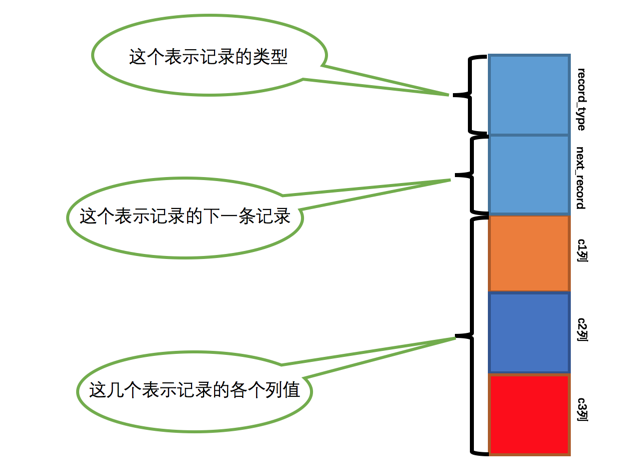
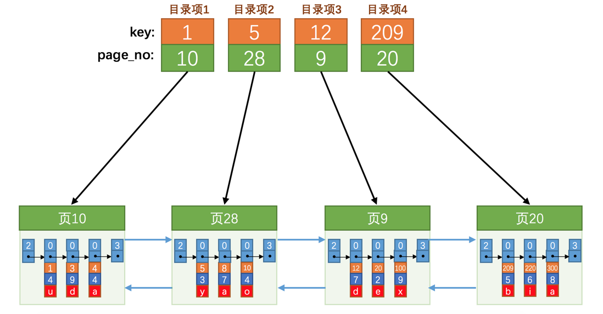
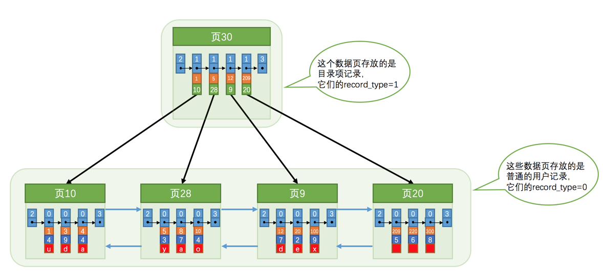
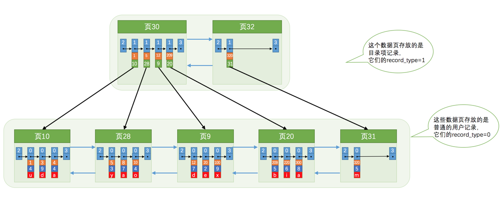
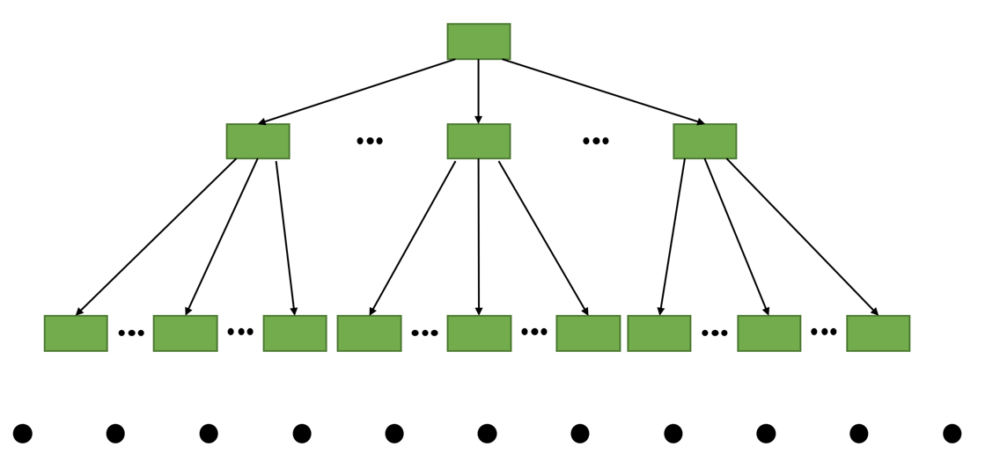
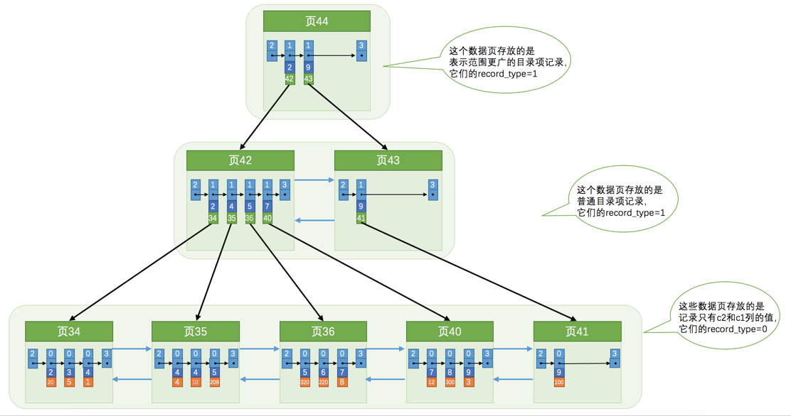
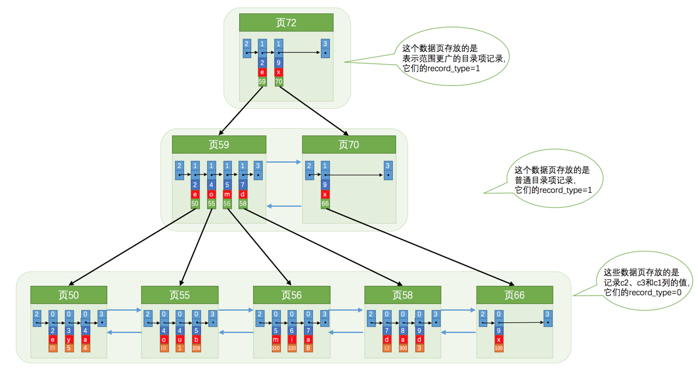
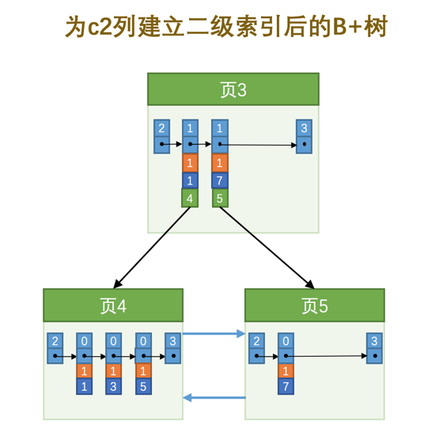

# B+樹

## 從頁到索引
圖格式

因为这些16KB的页在物理存储上可能并不挨着，所以如果想从这么多页中根据主键值快速定位某些记录所在的页，我们需要给它们做个目录，每个页对应一个目录项，每个目录项包括下边两个部分：
- key:页的用户记录中最小的主键值，我们用key来表示。
- page_no:页号，我们用page_no表示。

使用普通數據格式存儲索引數據

从图中可以看出来：
- 新分配了一个编号为30的页来专门存储目录项记录。
- 目录项记录的record_type值是1，而普通用户记录的record_type值是0。
- 目录项记录只有主键值和页的编号两个列，而普通的用户记录的列是用户自己定义的，可能包含很多列，另外还有InnoDB自己添加的隐藏列。
- 还记得我们之前在唠叨记录头信息的时候说过一个叫min_rec_mask的属性么，只有在存储目录项记录的页中的主键值最小的目录项记录的min_rec_mask值为1，其他别的记录的min_rec_mask值都是0。

如果一頁不夠存儲索引的，那麼新增頁存儲罷了

现在以查找主键为20的记录为例，根据某个主键值去查找记录的步骤就可以大致拆分成下边两步：
- 确定目录项记录页

我们现在的存储目录项记录的页有两个，即页30和页32，又因为页30表示的目录项的主键值的范围是[1, 320)，页32表示的目录项的主键值不小于320，所以主键值为20的记录对应的目录项记录在页30中。
- 通过二分法快速定位到对应目录项，因为12 < 20 < 209，所以定位到对应的记录所在的页就是页9。
- 再到存储用户记录的页9中根据二分法快速定位到主键值为20的用户记录。

如果索引數據太多，檢索效率下降，那麼可以給索引之上再建立索引，由此產生了二層索引、三層索引⋯⋯

我们的实际用户记录其实都存放在B+树的最底层的节点上，这些节点也被称为叶子节点或叶节点，
其余用来存放目录项的节点称为非叶子节点或者内节点，其中B+树最上边的那个节点也称为根节点。

## 聚簇索引
- 页内的记录是按照主键的大小顺序排成一个单向链表。
- 各个存放用户记录的页也是根据页中用户记录的主键大小顺序排成一个双向链表。
- 存放目录项记录的页分为不同的层次，在同一层次中的页也是根据页中目录项记录的主键大小顺序排成一个双向链表。
- B+树的叶子节点存储的是完整的用户记录。

在InnoDB存储引擎中，聚簇索引就是数据的存储方式（所有的用户记录都存储在了叶子节点），也就是所谓的索引即数据，数据即索引。
## 二級索引 
使用非主鍵的其他一個字段建立的索引，稱為二級索引。二級索引的葉子節點只存儲索引列和主鍵值，查詢需要回到聚簇索引中回表。

## 聯合索引
使用非主鍵的其他多個字段建立的索引，稱為聯合索引。聯合索引的葉子節點存儲索引列1，索引列2和主鍵值，排序以索引列1值為主排序，當索引列1值都一樣的時候以索引列2值排序。

## InnoDB的B+树索引的注意事项
### 根页面万年不动窝
B+树的形成过程是这样的：
- 每当为某个表创建一个B+树索引（聚簇索引不是人为创建的，默认就有）的时候，都会为这个索引创建一个根节点页面。最开始表中没有数据的时候，每个B+树索引对应的根节点中既没有用户记录，也没有目录项记录。
- 随后向表中插入用户记录时，先把用户记录存储到这个根节点中。
- 当根节点中的可用空间用完时继续插入记录，此时会将根节点中的所有记录复制到一个新分配的页，比如页a中，然后对这个新页进行页分裂的操作，得到另一个新页，比如页b。这时新插入的记录根据键值（也就是聚簇索引中的主键值，二级索引中对应的索引列的值）的大小就会被分配到页a或者页b中，而根节点便升级为存储目录项记录的页。

### 内节点中目录项记录的唯一性
为了让新插入记录能找到自己在那个页里，我们需要保证在B+树的同一层内节点的目录项记录除页号这个字段以外是唯一的。所以对于二级索引的内节点的目录项记录的内容实际上是由三个部分构成的：
- 索引列的值
- 主键值
- 页号

如下表
c1|	c2|	c3
----|----|----
1	|1|	'u'
3	|1|	'd'
5	|1|	'y'
7	|1|	'a'

把主键值也添加到二级索引内节点中的目录项记录了，这样就能保证B+树每一层节点中各条目录项记录除页号这个字段外是唯一的，
所以我们为c2列建立二级索引后的示意图实际上应该是这样子的：

插入记录(9, 1, 'c')时，可以知道應該插在頁5中

### 一个页面最少存储2条记录

