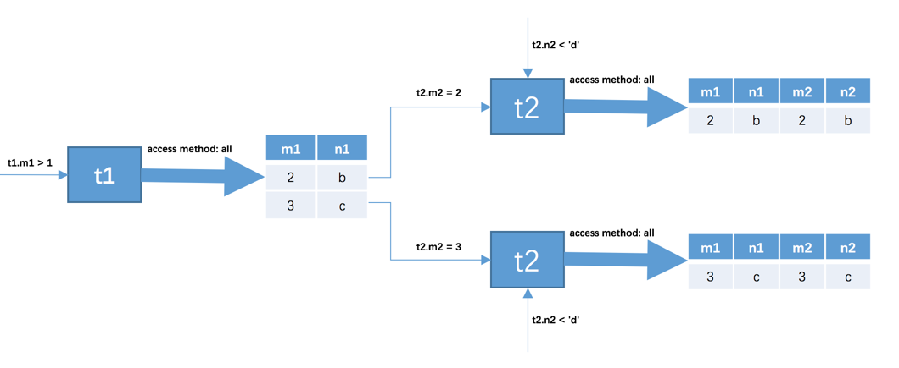
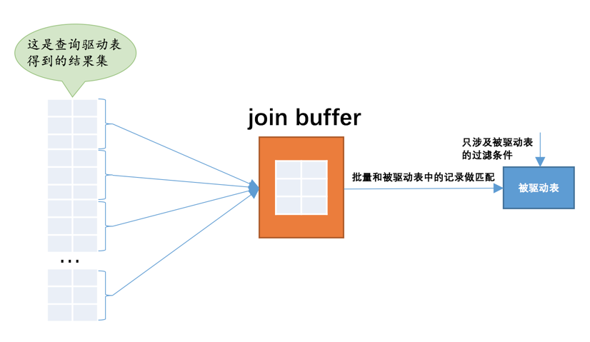

# join

## 连接过程简介
基础数据

    mysql> select * from t1;
    +------+------+
    | m1   | n1   |
    +------+------+
    |    1 | a    |
    |    2 | b    |
    |    3 | c    |
    +------+------+
    3 rows in set (0.00 sec)
    
    mysql> select * from t2;
    +------+------+
    | m2   | n2   |
    +------+------+
    |    2 | b    |
    |    3 | c    |
    |    4 | d    |
    +------+------+
    3 rows in set (0.00 sec)
    
    mysql> select * from t1,t2;
    +------+------+------+------+
    | m1   | n1   | m2   | n2   |
    +------+------+------+------+
    |    1 | a    |    2 | b    |
    |    2 | b    |    2 | b    |
    |    3 | c    |    2 | b    |
    |    1 | a    |    3 | c    |
    |    2 | b    |    3 | c    |
    |    3 | c    |    3 | c    |
    |    1 | a    |    4 | d    |
    |    2 | b    |    4 | d    |
    |    3 | c    |    4 | d    |
    +------+------+------+------+
    9 rows in set (0.00 sec)

查询
```SELECT * FROM t1, t2 WHERE t1.m1 > 1 AND t1.m1 = t2.m2 AND t2.n2 < 'd';```
    
在两表连接查询中，驱动表只需要访问一次，被驱动表可能被访问多次。

## 内连接和外连接
- 对于内连接的两个表，驱动表中的记录在被驱动表中找不到匹配的记录，该记录不会加入到最后的结果集，我们上边提到的连接都是所谓的内连接。

- 对于外连接的两个表，驱动表中的记录即使在被驱动表中没有匹配的记录，也仍然需要加入到结果集。
在MySQL中，根据选取驱动表的不同，外连接仍然可以细分为2种：

    - 左外连接,选取左侧的表为驱动表。
    - 右外连接,选取右侧的表为驱动表。

两种过滤条件：
- WHERE子句中的过滤条件

- ON子句中的过滤条件

对于外连接的驱动表的记录来说，如果无法在被驱动表中找到匹配ON子句中的过滤条件的记录，那么该记录仍然会被加入到结果集中，对应的被驱动表记录的各个字段使用NULL值填充。

内连接中的WHERE子句和ON子句是等价的。

```
SELECT * FROM t1 LEFT [OUTER] JOIN t2 ON 连接条件 [WHERE 普通过滤条件];
SELECT * FROM t1 RIGHT [OUTER] JOIN t2 ON 连接条件 [WHERE 普通过滤条件];
SELECT * FROM t1 [INNER | CROSS] JOIN t2 [ON 连接条件] [WHERE 普通过滤条件];

mysql> SELECT s1.number, s1.name, s2.subject, s2.score FROM student AS s1 LEFT JOIN score AS s2 ON s1.number = s2.number;
```

内连接和外连接的根本区别就是在驱动表中的记录不符合ON子句中的连接条件时不会把该记录加入到最后的结果集

不论哪个表作为驱动表，两表连接产生的笛卡尔积肯定是一样的。

对于内连接来说，驱动表和被驱动表是可以互换的，并不会影响最后的查询结果

左外连接和右外连接的驱动表和被驱动表不能轻易互换。

## 連接的原理
### 嵌套循环连接（Nested-Loop Join）
这种驱动表只访问一次，但被驱动表却可能被多次访问，访问次数取决于对驱动表执行单表查询后的结果集中的记录条数的连接执行方式称之为嵌套循环连接

### 使用索引加快连接速度
```SELECT * FROM t1, t2 WHERE t1.m1 > 1 AND t1.m1 = t2.m2 AND t2.n2 < 'd';```
- 在m2列上建立索引，因为对m2列的条件是等值查找，比如t2.m2 = 2、t2.m2 = 3等，所以可能使用到ref的访问方法，
假设使用ref的访问方法去执行对t2表的查询的话，需要回表之后再判断t2.n2 < d这个条件是否成立。

在单表中使用主键值或者唯一二级索引列的值进行等值查找的方式称之为const

在连接查询中对被驱动表使用主键值或者唯一二级索引列的值进行等值查找的查询执行方式称之为：eq_ref。

- 在n2列上建立索引，涉及到的条件是t2.n2 < 'd'，可能用到range的访问方法，
假设使用range的访问方法对t2表的查询的话，需要回表之后再判断在m2列上的条件是否成立。

### 基于块的嵌套循环连接（Block Nested-Loop Join）
尽量减少访问被驱动表的次数。

所以我们可不可以在把被驱动表的记录加载到内存的时候，一次性和多条驱动表中的记录做匹配，这样就可以大大减少重复从磁盘上加载被驱动表的代价了

所以设计MySQL的大叔提出了一个join buffer的概念，join buffer就是执行连接查询前申请的一块固定大小的内存，
先把若干条驱动表结果集中的记录装在这个join buffer中，然后开始扫描被驱动表，每一条被驱动表的记录一次性和join buffer中的多条驱动表记录做匹配，
因为匹配的过程都是在内存中完成的，所以这样可以显著减少被驱动表的I/O代价


设计MySQL的大叔把这种加入了join buffer的嵌套循环连接算法称之为基于块的嵌套连接（Block Nested-Loop Join）算法。

这个join buffer的大小是可以通过启动参数或者系统变量join_buffer_size进行配置，默认大小为262144字节（也就是256KB），最小可以设置为128字节

另外需要注意的是，驱动表的记录并不是所有列都会被放到join buffer中，只有查询列表中的列和过滤条件中的列才会被放到join buffer中，
所以再次提醒我们，最好不要把*作为查询列表，只需要把我们关心的列放到查询列表就好了，这样还可以在join buffer中放置更多的记录


